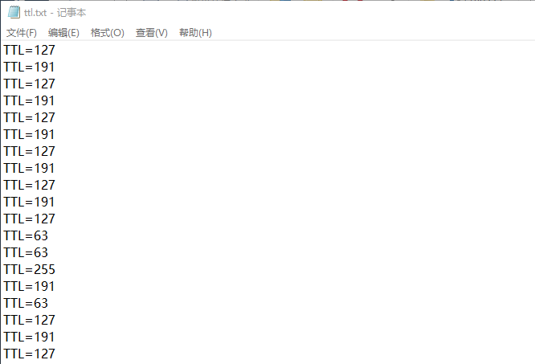
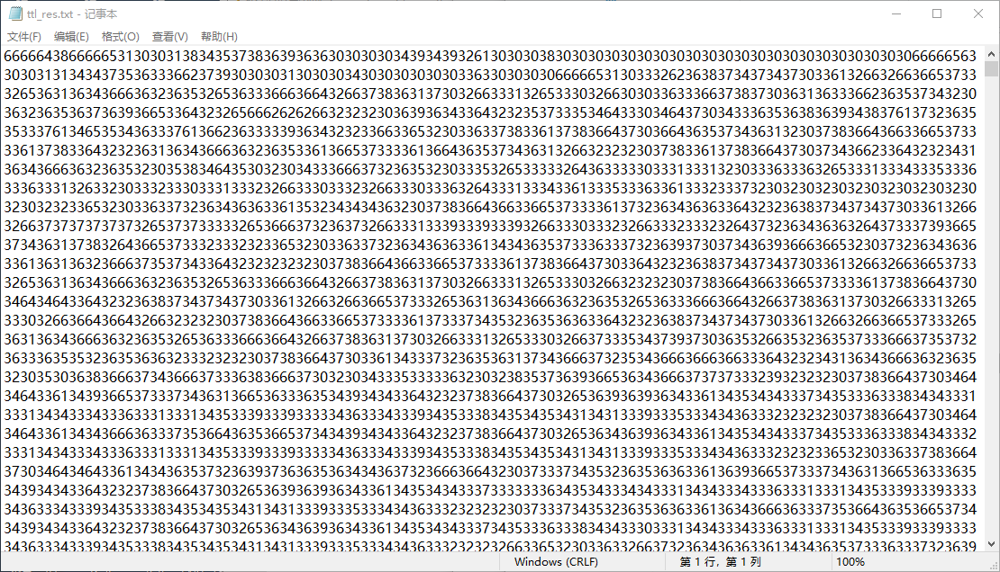
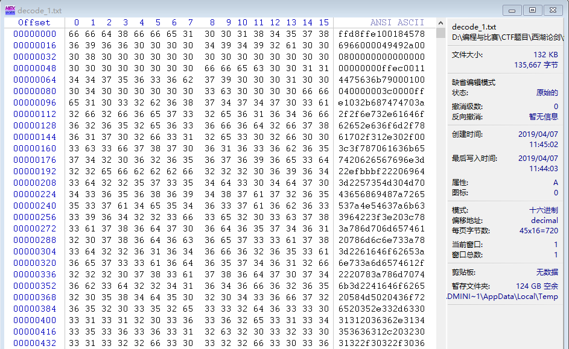
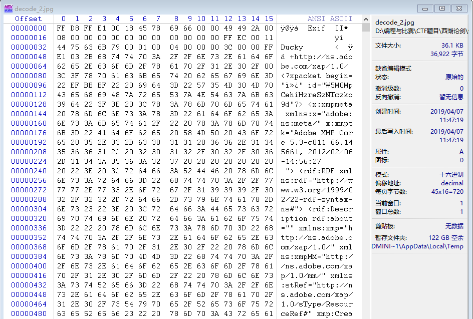
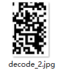
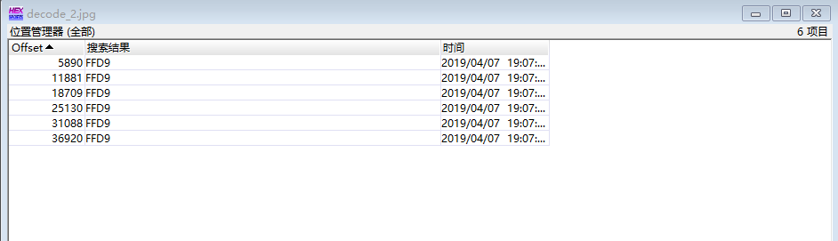
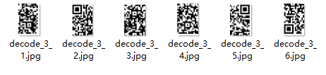

所以说，近期铺天盖地宣传的“西湖论剑”网络安全技能赛预选已经结束了。在这里随便糊一篇文章（也是我第一次写Write-Up文章），就聊聊杂项最先放出的那个第二题的解法。

首先拿到题，解压，发现里面有“题目描述”，先看描述，是这么写的：

**我们截获了一些IP数据报，发现报文头中的TTL值特别可疑，怀疑是通信方嵌入了数据到TTL，我们将这些TTL值提取了出来，你能看出什么端倪吗？**

然后看给出的另一个文件，`ttl.txt`，里面的内容是这样的：



不难发现TTL值只有 $63$，$127$，$191$，$255$ 四种，都是$2$的某次幂$-1$的值。于是将这四个数都转换成二进制，得到 $111111_2$、$1111111_2$、$10111111_2$、$11111111_2$ 四个二进制数。从后面两个数字可以观察到二进制数的开头两位似乎有关系。又因为TTL值为一个8位整数，进行合理猜想，不妨将不足8位的二进制数开头补0，变为8位后再取开头两位。即：$00111111_2$、$01111111_2$、$10111111_2$、$11111111_2$提取开头两位为：$00_2$、$01_2$、$10_2$、$11_2$，恰好为全排列，可以用于数据的存储。

<!--more-->

这样每组两个比特，四组就可以组成一个字节。博客园上也有文章提到了这种数据隐藏方式（[点击这里](https://www.cnblogs.com/k1two2/p/5170213.html)）。

随后编写脚本，将这些数据进行处理并将得到的二进制数据转为十六进制明文。Python脚本代码如下：（假设输入文件为`ttl.txt`，输出文件为`ttl_res.txt`)

```python
infile = open("ttl.txt", "r")
outfile = open("ttl_res.txt", "w")

ascii_data = ""
num = 0

for i in range(295376):
    tmp = infile.readline();
    tmp = tmp[4:len(tmp)-1]
    bin_data = bin(int(tmp))[2:]
    bin_len = len(bin_data)
    if bin_len != 8:
        for j in range(8-bin_len):
            bin_data = "0" + bin_data
    bin_val = bin_data[:2]
    ascii_data += bin_val
    num += 1
    if num == 4:
        num = 0
        msg_hex = hex(int(ascii_data, 2))[2:]
        if len(msg_hex) < 2:
            msg_hex = "0" + msg_hex
        outfile.write(msg_hex)
        ascii_data = ""

infile.close()
outfile.close()
```

得到的文件是这个样子的：



随后打开WinHex，新建文件，将记事本中的内容全选、复制，粘贴到WinHex中，粘贴方式选择“ASCII Hex”，得到如下结果：



另存为txt文件，怀疑其仍为16进制数据。在WinHex中再次新建文件，重复上述操作，得到：



`FF D8 FF E1`是JPEG文件头部标志，因此保存为jpg。能从缩略图发现这是一个二维码，但是不完整。



怀疑该文件中含有多张JPEG图片。搜索JPEG文件尾标志`FF D9`，结果如下：



将6个JPEG文件分别提取保存为新的文件，得：



分别是同一个二维码的不同部分。利用Photoshop拼接得到完整二维码：


二维码识别，扫描结果为：

```text
key:AutomaticKey cipher:fftu{2028mb39927wn1f96o6e12z03j58002p}
```

这并非flag原文而是密文。前面的key字段有两个含义：加密方式为 **AutoKey Chiper** 且加密密钥为`AutomaticKey`。找到[在线解密网站](http://www.practicalcryptography.com/ciphers/classical-era/autokey/)进行解密（注意：这个网站只会将字母解密，因为符号和数字在密码加密前后不变，因此网站自动忽略了对它们的处理），用解密后的字母替换解密之前的字母得到真正的flag：

```text
flag{2028ab39927df1d96e6a12b03e58002e}
```