最近在咸鱼上淘到了一个二手的华硕 Chromebook（具体型号是 ASUS C302CA）。四核 M3-6Y30 + 8G 运行内存+ 32G eMMC 存储 + 12.5 寸触摸屏，虽然机身有少量磕碰，笔记本的转折铰链也有问题，但 800 元的价格着实实惠。

机器寄过来的时候依然是原装系统（Power Wash 过的 Chrome OS）。写个文章记录将操作系统从 Chrome OS 换成 Manjaro 和 Windows 10 的过程。

## 拆写保护（WP）螺丝

Chromebook 的 BIOS 都是为了配合 Chrome OS 而特殊定做的，因此无法用来启动其他操作系统，没有 BIOS 设置界面，也无法升级 BIOS。但是可能是出于修理和防止可能的 BIOS 紧急固件更新，制造商仍然允许使用者解除 BIOS 的写入保护。常见的保护方式在 [Chromium Projects Wiki](https://dev.chromium.org/chromium-os/firmware-porting-guide/firmware-ec-write-protection) 里有详细说明：

<!--more-->

> **Application Processor (AP) Firmware**
>
> AP firmware (also known as "SOC firmware", "host firmware", "main firmware" or even "BIOS") typically resides on a SPI ROM. Protection registers on the SPI ROM are programmed to protect the read-only region, and these registers normally cannot be modified while the SPI ROM WP (write protect) pin is asserted. This pin is asserted through various physical means (see below), but with effort, users can unprotect devices they own.
>
> **Embedded Controller (EC) Firmware**
>
> The Chrome OS Embedded Controller (EC) typically has a WP input pin driven by the same hardware that generates SOC firmware write protect. While this pin is asserted, certain debug features (eg. arbitrary I2C access through host commands) are locked out. Some ECs load code from external storage, and for these ECs, RO protection works similar to SOC firmware RO protection (WP pin is asserted to EC SPI ROM). Other ECs use internal flash, and these ECs emulate SPI ROM protection registers, disabling write access to certain regions while the WP pin is asserted.

解除写保护的操作在 Wiki 里同样有说明：

> **Methods of Asserting Write Protect**
>
> Throughout the history of Chrome OS devices, three main methods have been implemented for asserting (and removing) write protect:
>
> - Switch - a toggle switch asserts WP to the SOC firmware SPI ROM and EC. WP can be deasserted by disassembling the device and flipping the switch.
> - Screw - a screw shorts a pad on the PCB. While this screw is inserted, WP is asserted. WP can be deasserted by disassembling the device and removing this special screw.
> - cr50 - a special security chip asserts the WP signal. While a battery is present on the device, the WP signal will be asserted. Disassembling the device and physically disconnecting the battery causes WP to be deasserted.
>
> More information about which protection method is used for a particular device, and where to locate the switch / screw, is available on the developer info page.

ASUS C302CA 这个型号的超极本使用的是”Screw（螺丝）“方法，因此我们需要拆开后盖，拧下主板上的 BIOS 写保护螺丝。注意在拆卸背板的时候，有两颗螺丝藏在上侧脚垫下，需要先用工具去除脚垫再拆卸这两颗螺丝。下侧的两个脚垫下没有螺丝。如图所示，图片来源请[点击此处](https://www.lafaspot.com/2017/03/asus-c302-internal-teardown-model-is-32.html)。

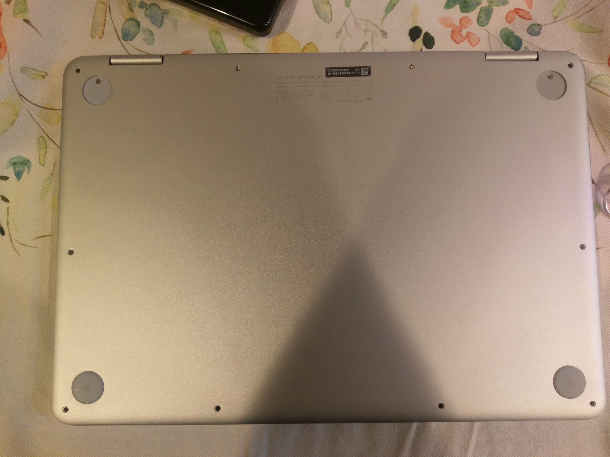

随后移除后盖，就能看到主板和电池。在主板上由小条黑布覆盖的螺丝即为写保护螺丝，小心拧下即可。位置见下图白色圈内，图片来源请[点击此处](https://www.reddit.com/r/chromeos/comments/66dhgb/asus_flip_c302ca_write_protect_screw/)。

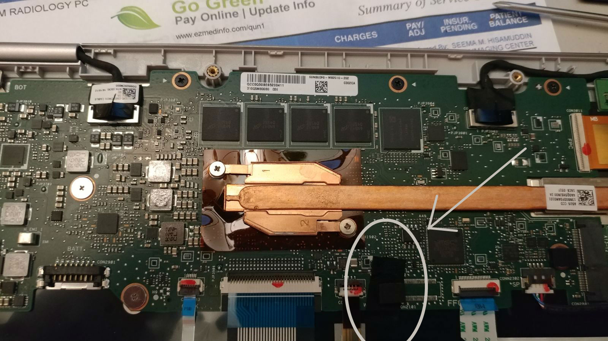

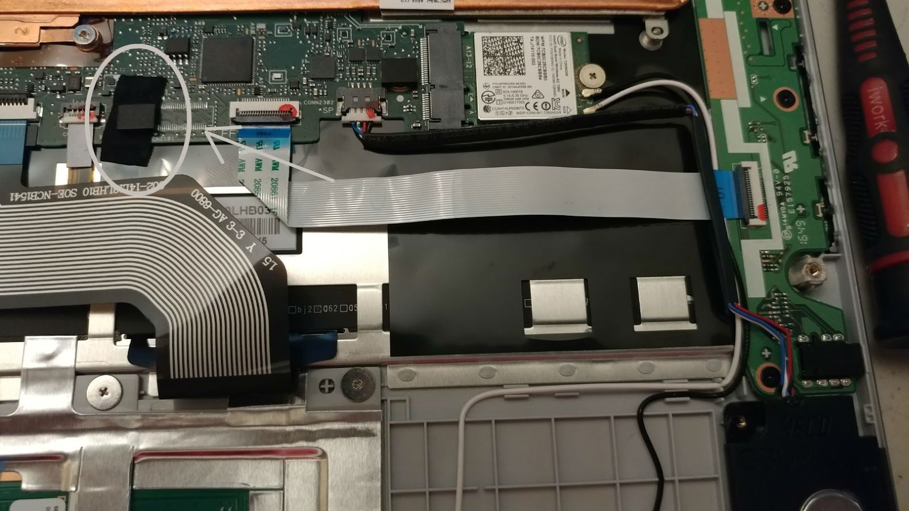

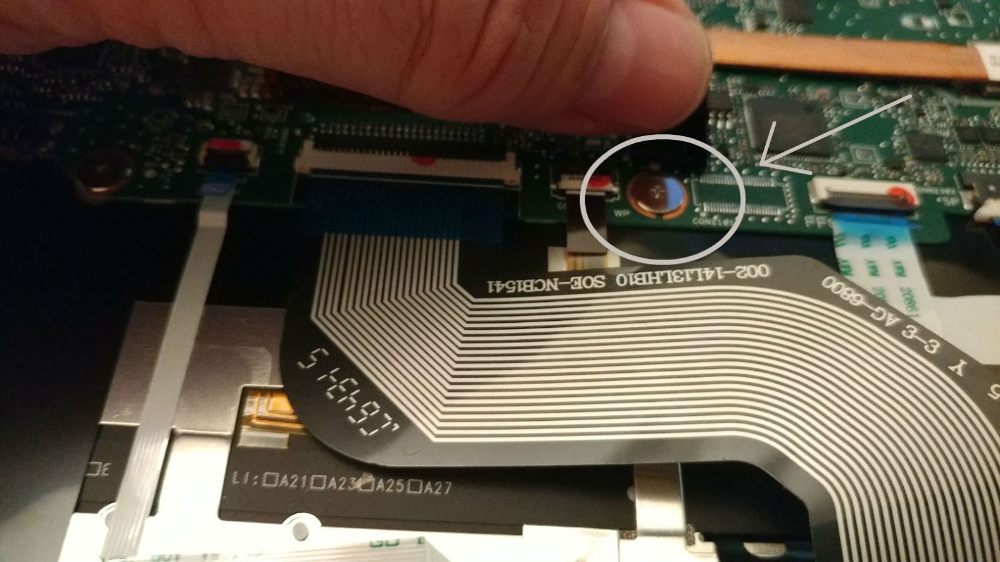

拧下保护螺丝后，将后盖放回拧好。之后进入Chrome OS开发者模式。

## 进入开发者模式

按住键盘上的Esc和“刷新”键不动，然后按下电源键。这样Chromebook会进入“恢复”模式——有点像安卓手机上的Recovery。

> 此步骤开始，由于真实操作时没有保留图片，因此借用来源于网络的图片说明操作步骤。

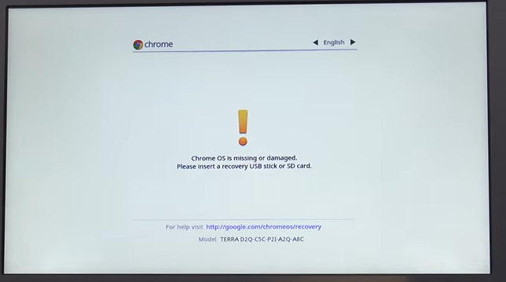

同时按下键盘上的Ctrl键和D键，提示如下：

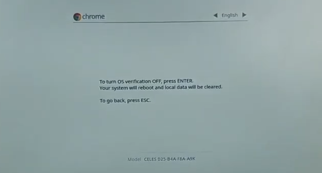

按下Enter，系统重启：

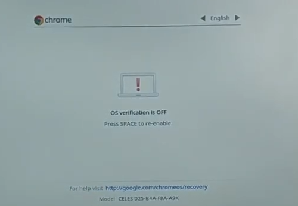

这个时候应该会伴有一声BIOS提示音。这个提示音使用原版BIOS时是无法关闭的。为了安装其他操作系统和屏蔽该提示音，必须刷新BIOS。

随后等待Chrome OS重置即可。你需要重新配置和登录Chrome OS以启动Shell。

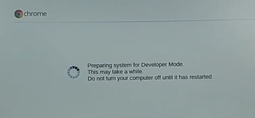

## 更换BIOS固件

使用到的是第三方维护的BIOS，MrChromebox.tech。
可到这里（<https://mrchromebox.tech/#devices>）查询你的Chromebook有没有适配。

你需要准备：一个空的U盘

下面开始操作。首先开机登录已处于开发者模式的Chrome OS。按下组合键：`Ctrl + Alt + F2`。浏览器会打开新标签页，启动crosh。

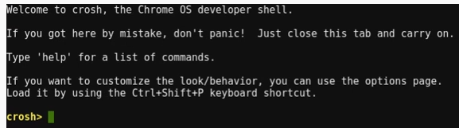

输入命令`shell`，回车，会启动真实的Linux Shell。

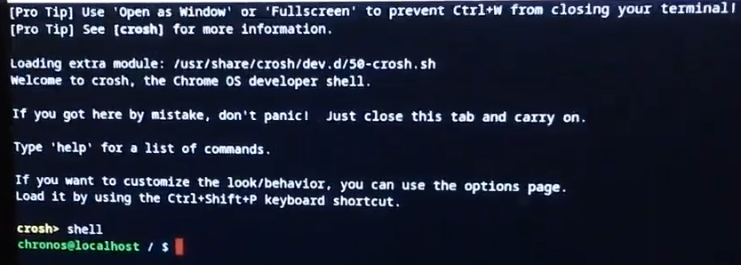

插入空U盘，确保其已经挂载，随后在Shell内输入如下命令：

```bash
cd
curl -LO mrchromebox.tech/firmware-util.sh
sudo install -Dt /usr/local/bin -m 755 firmware-util.sh
sudo firmware-util.sh
```

成功下载并启动脚本后，有如下界面：

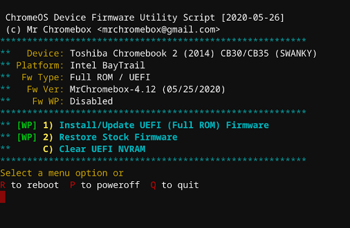

选择第一个选项（注：标识了“Full ROM”的选项），按照提示备份BIOS和刷入BIOS，重启，即可。

## 安装操作系统

与正常电脑安装操作系统无异。需要注意以下几点：

- 只支持UEFI启动。因此诸如Windows 7或Tiny Core Linux之类的操作系统是不行的。
- 制作可启动U盘：Windows系列推荐使用Windows PE（如[优启通](https://www.itsk.com/forum.php?mod=viewthread&tid=415848)），Linux系列推荐使用[Rufus](https://rufus.akeo.ie/)。
- 需要先使用分区工具，删除Chromebook的eMMC上所有分区后再进行安装。
- 对于C302，Linux下驱动基本完美。Win下驱动稍微复杂：
  - 准备有线鼠标，通过扩展坞连接到Chromebook，临时代替触摸板。
  - 链接WiFi，然后下载安装[DriverBooster](https://www.iobit.com/en/driver-booster.php)，可检测绝大多数驱动程序。将所有可更新的驱动程序更新至最新版本。
  - 到这里（<https://github.com/coolstar/driverinstallers/tree/master/crostouchpad>），下载安装4.1版本驱动。
  - 触摸板可以使用。触摸屏目前无解。
- Windows和主流Linux下声卡问题目前无解，可用外置USB声卡或蓝牙耳机代替。如果你迫切需要使用Chromebook的内置扬声器，请安装[GalliumOS](https://galliumos.org/)。
- 内置eMMC存储空间较小。可通过SD卡槽插入SD卡（推荐Class10或更高），结合软链接（[Linux](https://man7.org/linux/man-pages/man1/ln.1.html)、[Windows](https://schinagl.priv.at/nt/hardlinkshellext/linkshellextension.html)均可）的方式保留存储空间。
- Windows安装时推荐启用Compact压缩。