“Robust”意为“鲁棒性”。

打开cap.pcapng，发现都是QUIC协议的数据包。结合提供的firefox.log（即使用firefox浏览器访问时生成的SSL Key Log）可以想到基于QUIC协议且强制使用TLS 1.3的HTTP3。

导入SSL Key Log：

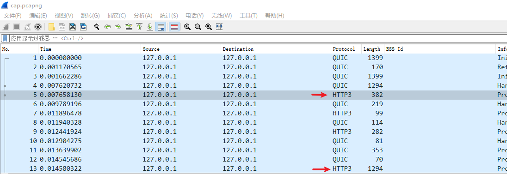

清晰可见HTTP3数据包。利用过滤器过滤出所有HTTP3数据包，然后从头查看：

```
http3
```

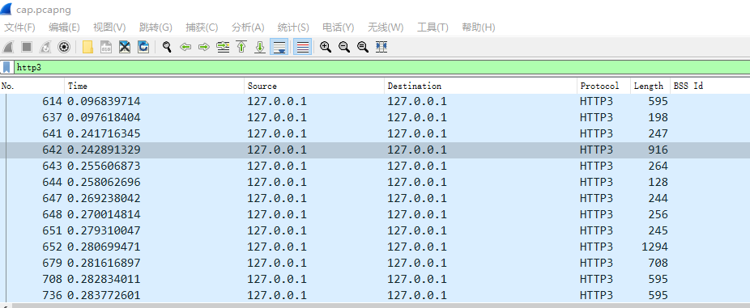

<!--more-->

可以明显看出，642号包之前的部分是在载入网页和JavaScript脚本。在第642号包处可以发现一个m3u8 playlist：

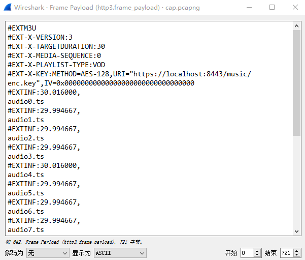

注意到是加密的直播流，因此想到浏览器应该获取到了解密Key。继续向下分析数据包，在第648号数据包处找到解密Key：

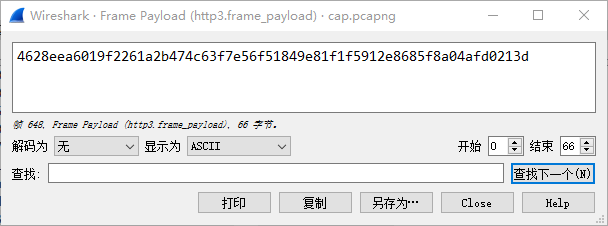

复制出来，另存为enc.key。

随后就是找到切片并提取切片了。600余个数据包，肯定不能手动进行处理（除非你有耐心）。因此依旧借助pyshark进行处理。有两种办法：

* 通过HTTP3数据包的类型和长度，判断每个切片的起始位置，再利用数据包内原始的m3u8 playlist和key做解密，随后合并。

* 依据MPEG-TS容器格式特性和AES-128-CBC加密方式特性，可以先合并，再解密。

下面以方法二为例解题。

编写脚本将所有的HTTP3 frame payload提取出来，并依次序写入同一个文件中：

```python
import pyshark
import os

cap = pyshark.FileCapture("cap.pcapng", override_prefs={"ssl.keylog_file": os.path.abspath("firefox.log")})
fd = open("output.ts", "wb")


for i in range(678, 18706):
    try:
        if int(cap[i].http3.frame_type) == 0:
            fd.write(cap[i].http3.frame_payload.binary_value)
    except Exception:
        continue

fd.close()
```

之后，构造只含一个切片的m3u8 playlist：

```
#EXTM3U
#EXT-X-VERSION:3
#EXT-X-MEDIA-SEQUENCE:0
#EXT-X-PLAYLIST-TYPE:VOD
#EXT-X-KEY:METHOD=AES-128,URI="enc.key",IV=0x00000000000000000000000000000000
#EXTINF:10000
output.ts
#EXT-X-ENDLIST
```

EXTINF可以随意给大，解密密钥的URI改为相对路径。随后使用FFMPEG进行解密即可。

```
ffmpeg -allowed_extensions ALL -i index.m3u8 -c copy outdec.ts
```

你也可以使用openssl。这里注意，HLS切片加密时遇到过长的Key会截取前128位作为加密密钥。

```
xxd -P enc.key
```

得到如下输出：

```
343632386565613630313966323236316132623437346336336637653536
663531383439653831663166353931326538363835663861303461666430
323133640d0a
```

取前128位进行解密即可：

```
openssl aes-128-cbc -d -in .\output.ts -out .\out.ts -iv 00000000000000000000000000000000 -K 34363238656561363031396632323631 -nosalt
```

随后，解密出的ts切片就可以直接播放了。利用Adobe Audition查看频谱：

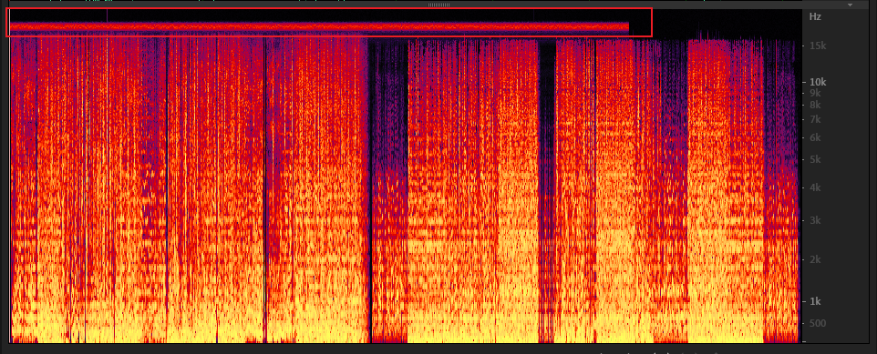

很明显这里包含了信息，需要解码。将数据通过转换变为声信号的过程很容易想到拨号上网时需要用到的的“调制解调器”。于是尝试搜索解码工具：

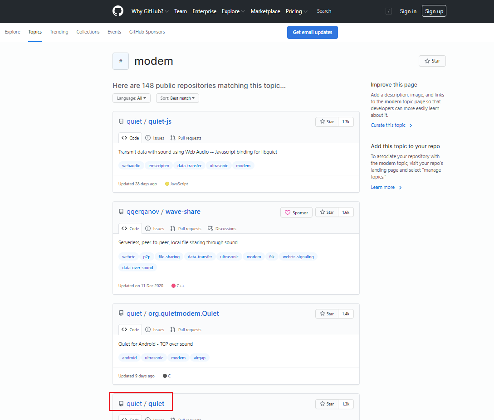

发现quiet工具（<https://github.com/quiet/quiet>）具有将数据转换为高频声信号（所谓的“ultrasonic”）的功能。

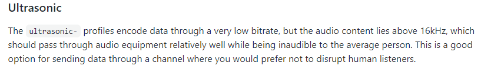

随后，clone两个repo：quiet/libfec和quiet/quiet，编译即可。编译过程略。

在默认配置文件quiet-profiles.json中，有多个以ultrasonic开头的配置。这时回到Audition，仔细观察频谱频率：

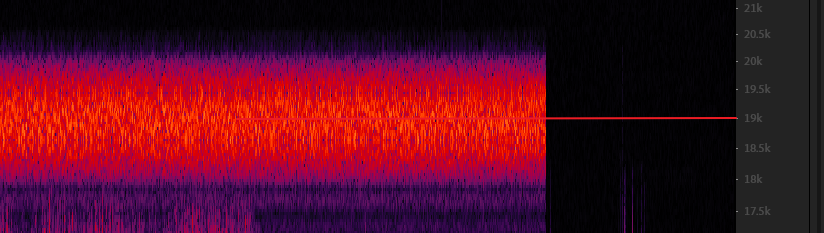

频谱很明显以19KHz为中心，这与ultrasonic配置文件的配置相吻合：

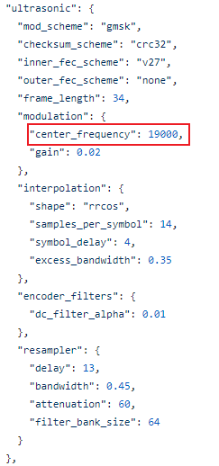

因此可以确定使用了该配置文件。

随后进行解码。可以直接使用quiet的API，当然也可使用quiet的示例程序。阅读示例程序代码decode_file.c：

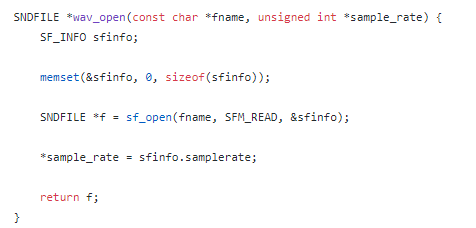

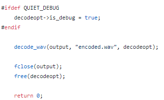

需要将待解码的文件转化为wav格式，且重命名为encoded.wav。联想到题目的“Robust”，意即“鲁棒性”，因此大胆直接转码。但是为了不丢失数据，保险起见，保持原采样率和最高量化位数：

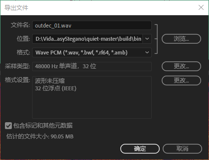

随后解码：

```
./quiet_decode_file ultrasonic out.txt
```

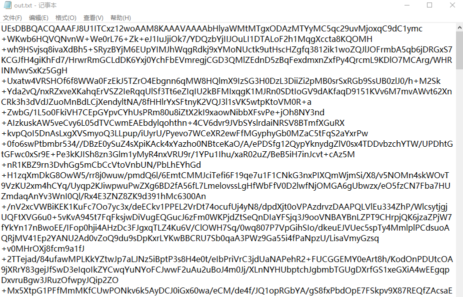

得到Base64，解码发现PK头，保存为Zip，打开，发现有密码：

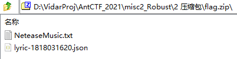

根据文件名称，联想到网易云音乐的歌词。至于是哪首歌的歌词，联想到网易云音乐有歌曲的“Song ID”。因此首先找到歌曲：

<https://music.163.com/song?id=1818031620>

随后提取歌词。

方法一：利用网页API。F12仔细分析即可找到歌词获取接口。例子如下：

```
https://music.163.com/weapi/song/lyric?csrf_token=7ab6599ebc00854e324f6dcf04353358
```

将网页内容保存为lyric-1818031620.json文件即可。

方法二：利用网易云音乐客户端缓存。容易找到缓存歌词的文件夹（以Windows系统为例）：C:\Users\ObjectNotFound\AppData\Local\Netease\CloudMusic\webdata\lyric

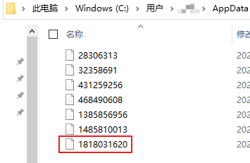

将该文件复制出来改名为lyric-1818031620.json即可。

然后就可以进行明文攻击了。可以使用Advanced Archive Password Recovery，也可以使用pkcrack。注意Zip的压缩算法设置。

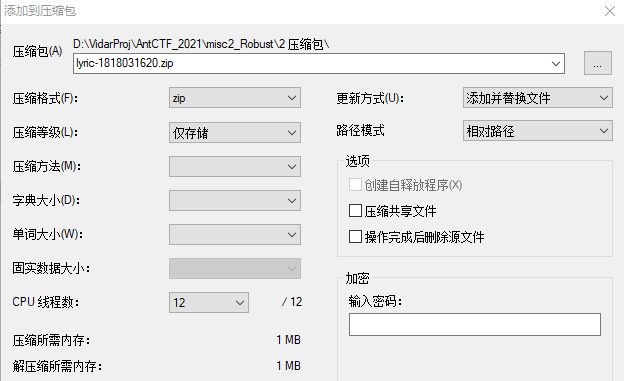

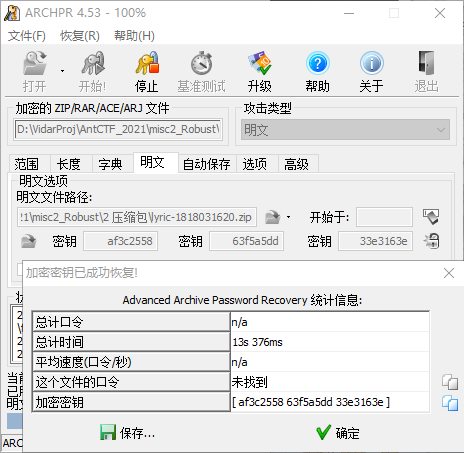

得到txt文档的内容：

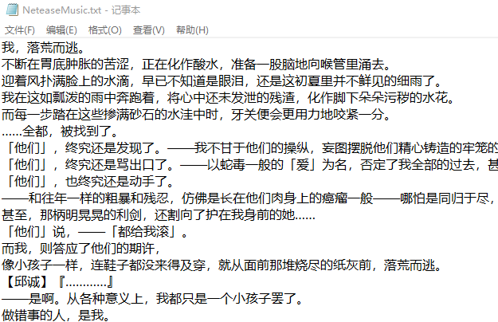

换用其他软件查看，发现存在空白字符隐写：

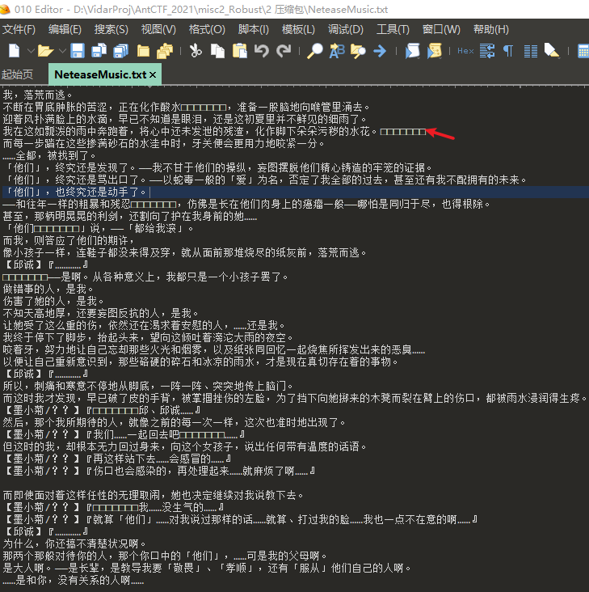

利用工具解密即可。注意选择正确的解码设置。可以使用十六进制编辑器的查找功能确定使用的编码字符。

<https://330k.github.io/misc_tools/unicode_steganography.html>

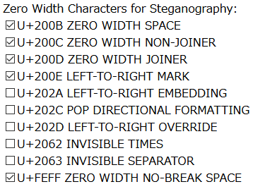

得到解码结果：

```
<~A2@_;ApZ7(GA0]MC.i&:F%'t#:JXSd=tj-$>'EtK0m.1t0i38~>
```

由定界符<~ ~>易知其为Base85编码。解码可得Flag：

```
d3ctf{1IwiKUjKcUsEn0OOJZZ0ZsZwUX1uiC1P}
```