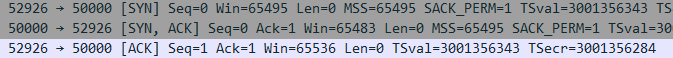
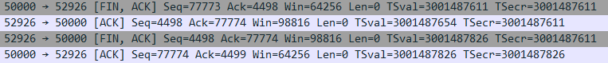
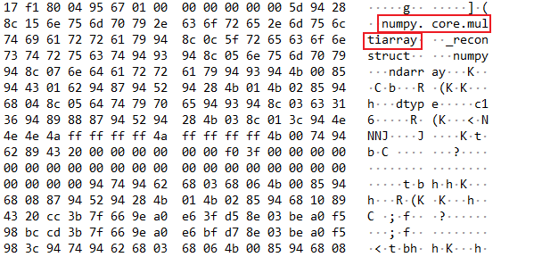
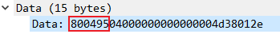
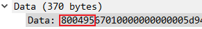
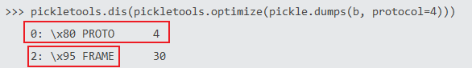
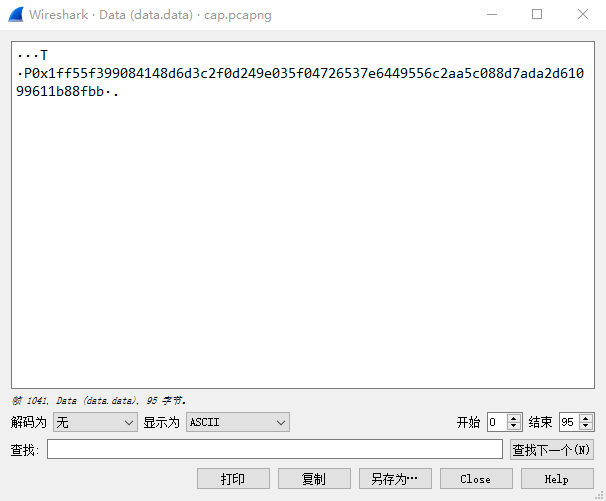
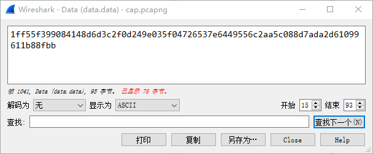
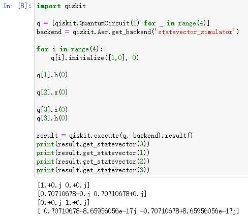
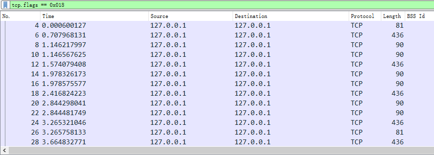

cap.pcapng用Wireshark打开，清晰可见TCP的三次握手和四次挥手：





于是需要仔细分析中间的数据传输过程。

注意到某些数据包内有“numpy”等字符串：



于是想到可能是某种兼容Python的序列化方法。

<!--more-->

又注意到有固定的头部数据：





而pickle序列化时也有固定的头部数据（协议版本4.0）：



于是尝试利用pickle进行反序列化。示例如下：

```python
import pyshark
import pickle

cap = pyshark.FileCapture('cap.pcapng')
test_pack = cap[3]
data = test_pack.data.data.binary_value

deserialized = pickle.loads(data)

print(deserialized)
```

得到结果312。随后发现之后的数据包的长度有规律：即436-(ACK)-90-(ACK)-90-(ACK)五个一组，或436-(ACK)-81-(ACK)两种组合。分别拿一组包进行反序列化测试：

```
Pack:327 Data:[array([0.70710678+0.j, 0.70710678+0.j]), array([ 0.70710678-8.65956056e-17j, -0.70710678+8.65956056e-17j]), array([0.+0.j, 1.+0.j]), array([1.+0.j, 0.+0.j])]
Pack:329 Data:
```

```
Pack:331 Data:[array([0.70710678+0.j, 0.70710678+0.j]), array([1.+0.j, 0.+0.j]), array([1.+0.j, 0.+0.j]), array([ 0.70710678-8.65956056e-17j, -0.70710678+8.65956056e-17j])]
Pack:333 Data:[0, 0, 1, 1]
Pack:335 Data:[0, 1, 0, 1]
```

又发现第1041个数据包处有疑似密文的数据：



题目中的“QKD”即量子密钥分发。常见的QKD协议有BB84、B92、E91等。结合前面的关于流程的分析（通过状态向量传递量子、两个数组先后传递Bob的测量基和Alice的判断结果）可以确定使用BB84协议进行的密钥分发。这就也能解释开头处传输的“312”：Alice和Bob需要提前约定好密钥长度。（严谨的BB84密钥交换协议中包括纠错、保密放大、认证等流程，此处略去）

同时注意到密文与密钥一样是312字节，考虑可能是流密码对每一位进行加密。



而如上述序号为329的数据包处的空数据，结合量子传输过程中不可直接窃听的特性，可以想到存在窃听者Eve，测量了量子后使Bob没有收到Alice传输的量子。

通过量子的状态向量和题目中给出的量子初始状态，已经可以判断出对量子进行操作的量子门及其顺序，因此就相当于获得了Alice传输的量子。这也是题目中“Debug info”的含意。



编写程序解密即可。

增补：为降低难度，量子的初状态已经已题目描述的方式给出。参考资料的不同可能导致对状态向量的理解上产生偏差。为降低难度，此题使用量子数学的表示方式，即：

$ \left| \phi \right> = \alpha \left| 0 \right> + \beta \left| 1 \right> $ 得到 $ [\alpha, \beta] $

为方便处理，过滤掉所有不包含数据的包，并存为新的文件：

```
tcp.flags == 0x018
```



随后编写脚本解密即可。示例脚本如下：

```python
import pyshark
import binascii
import qiskit
import pickle
from bitstring import BitArray


QUANLENG = 4


key = ""
cap = pyshark.FileCapture('cap2.pcapng')


def decrypt_msg(enckey: BitArray, msg: BitArray):
    res = BitArray()
    for i in range(msg.len):
        tmp = enckey[i] ^ msg[i]
        res.append("0b" + str(int(tmp)))
    return res


def recv_quantum(quantum_state: list):
    # Load state
    quantum = [qiskit.QuantumCircuit(1, 1) for _ in range(4)]
    # Recover quantum
    for i in range(4):
        real_part_a = quantum_state[i][0].real
        real_part_b = quantum_state[i][1].real
        if real_part_a == 1.0 and real_part_b == 0.0:
            continue
        elif real_part_a == 0.0 and real_part_b == 1.0:
            quantum[i].x(0)
        elif real_part_a > 0.7 and real_part_b > 0.7:
            quantum[i].h(0)
        else:
            quantum[i].x(0)
            quantum[i].h(0)
    return quantum


def measure(receiver_bases: list, quantum: list):
    # Change quantum bit
    for i in range(4):
        if receiver_bases[i]:
            quantum[i].h(0)
            quantum[i].measure(0, 0)
        else:
            quantum[i].measure(0, 0)
        quantum[i].barrier()
    # Execute
    backend = qiskit.Aer.get_backend("statevector_simulator")
    result = qiskit.execute(quantum, backend).result().get_counts()
    return result


def get_key(qubits: list, bases: list, compare_result: list):
    measure_result = measure(bases, qubits)
    for i in range(4):
        if compare_result[i]:
            tmp_res = list(measure_result[i].keys())
            global key
            key += str(tmp_res[0])


if __name__ == "__main__":
    key_len = pickle.loads(cap[0].data.data.binary_value)
    i = 1
    while i < 567:
        if int(cap[i+1].data.len) == 15:
            i += 2
            continue
        quantum_state = pickle.loads(cap[i].data.data.binary_value)
        quantum = recv_quantum(quantum_state)
        bob_bases = pickle.loads(cap[i+1].data.data.binary_value)
        alice_judge = pickle.loads(cap[i+2].data.data.binary_value)
        get_key(quantum, bob_bases, alice_judge)
        i += 3
    key = key[:key_len]
    msg = BitArray(pikle.loads(cap[567].data.data.binary_value))
    plaintext = decrypt_msg(BitArray("0b"+key), msg)
    print(plaintext.tobytes())
```

得到Flag:

```
d3ctf{y1DcuFuYwCgRfX33uT1lgSy27jYIsF4i}
```

当然，使用量子状态向量、Bob的测量基和测量结果的直接对应关系直接得出结果（即不需要模拟）也是可以的。这里不再赘述。