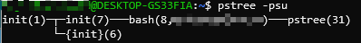
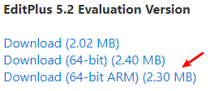
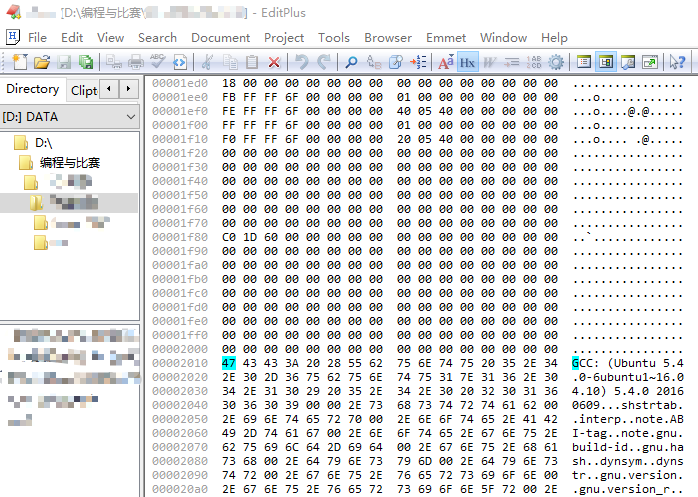
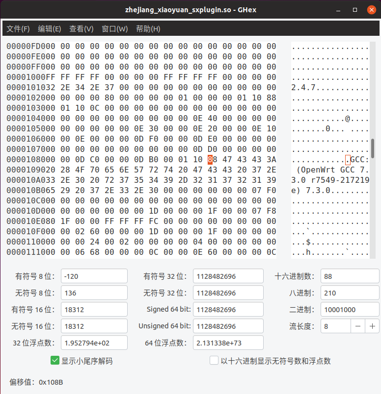
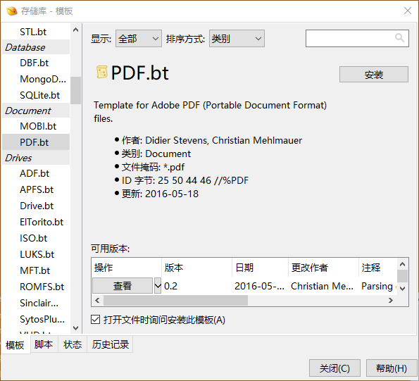
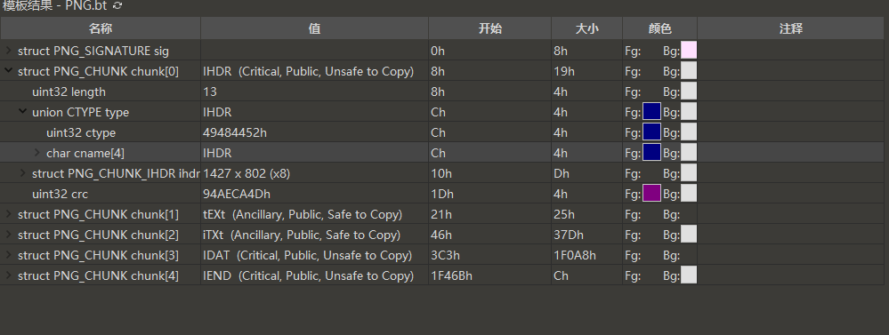
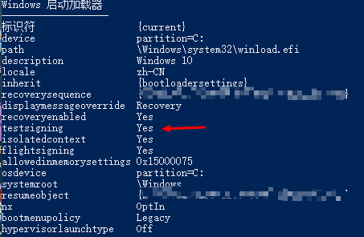
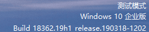

**文章内容：Linux 下查看进程依赖，不同的16进制编辑器，与关掉Windows驱动签名认证**

最近又学到了一些零零碎碎的 Linux、Windows 命令，和一些可能今后会用得着的小技巧，怕自己忘记，所以把它们写在博客里面提醒一下自己，免得到时候再花费大量时间去百度、Google 找文章。

## Linux 下查看进程树？

查看进程有好几种方式，`top`、`htop` 这种可视化的，还有 `ps` 这种纯文本输出的程序都可以做到。但是如果想要查看某一进程的父进程或者子进程PID该怎么办？可以借助另一个程序，`pstree`。参数很灵活，可以根据需要启用或关闭。程序截图如下：



## WinHex 的替代品？

WinHex是很强大的一个二进制文件查看和编辑工具（尤其是做 CTF 杂项题的时候 :）。虽然说现在全网随便搜搜就有破解版（Cracked Version）可以用，但是多了解几个 WinHex 的替代品，有备无患。

### EditPlus

说起来很巧，这个神器还是我在学校图书馆电脑上发现的。本来以为这东西只能编辑编辑文本，做 Notepad++ 的小弟，没想到这还能打开二进制文件查看16进制数据（emmm，不能编辑），而且...还支持 Windows ARM。



<!--more-->

打开文件之后，点击 Edit->Hex Viewer 即可查看十六进制数据。



只不过这个并不是免费软件，但是注册码很容易搜到，[点击这里](https://blog.csdn.net/anhldd/article/details/85088715)。

### GHex

上面提到的 WinHex 和 EditPlus 都仅限于 Windows 系统。Linux 和 Mac 平台下虽然可以使用 `Vim + 插件`或是 `Visual Studio Code + 插件`来实现查看（甚至是编辑）二进制数据，但是有不少使用者吐槽体验不好，设置复杂。因此多个 Linux 包管理器的软件源中包含的开源工具 GHex 便成为了首选。

安装非常简单，`sudo apt-get install ghex`

界面展示如下：



### 010Editor

010Editor 也是一款收费软件，正版价格在 130 USD （每年）左右，且不提供中文语言界面。它的特点是可以载入预定义的文件格式模板（*.bt，即 Binary Template）。现如今已有不少用户向010Editor贡献了常见二进制文件的格式模板，可以方便的一键下载安装。



以PNG文件格式为例。安装PNG文件对应的文件格式模板后，加载PNG文件，可以看到：



能够直接看到该文件格式各字段对应的值。双击即可对该字段的值进行修改。

## 怎么关掉 Windows 的强制驱动程序签名认证？

一般来说，设备的驱动程序都会内含数字签名，防止操作系统开机时加载恶意制作的，或被程序等恶意修改的驱动程序。同时，微软公司也提供了一系列的通用驱动程序和 API，方便程序员开发和使用。

但是有些时候我们需要自己开发驱动，又或是需要安装些特殊的、不经由官方发布的驱动（例如某些玩机达人针对某一 Android 手机修改的 Fastboot 驱动等）时，Windows 会自动拦截安装请求。强制将文件复制到 drivers 文件夹并注册又会引起系统蓝屏。这个时候常见的操作是在开机时按 F8，选择“高级启动”菜单中的“禁用驱动程序签名强制”，然后系统便可以正常启动并加载未签名的驱动程序。

但是每次开机都需要按 F8 选择，不太方便。如果能默认“允许加载无数字签名的驱动程序“进行启动的话就好了。于是翻阅 BCD 文件，发现了下面这个参数：



上图中红色箭头标识的参数就是开启 Windows” 测试模式“的参数。当其值为 `Yes` 时，Windows 启动时自动进入测试模式，允许非官方的驱动程序的加载。而“无完整性检查”模式，允许无签名的驱动程序加载。

测试模式启用时，桌面上会出现这样的水印：



启用两种模式的命令很简单，管理员身份运行 cmd，输入如下命令即可：

```bash
bcdedit /set testsigning on
bcdedit /set nointegritychecks on
```

当然，关闭的话，以此类推：

```bash
bcdedit /set testsigning off
bcdedit /set nointegritychecks off
```

注：Windows ”测试模式“与 Windows ”安全模式“类似，是 Windows 自身为了某些特定目的而设计的内置模式，和 Windows 内测版、评估版的”机密模式”（就是右下角有 Microsoft Confidential 水印的内测模式）和“评估模式”（就是微软官方的180天测试版系统）并不相同。
