**文章内容：peco、bat，软链接与硬链接，Linux Shell Options，Windows 展台模式，LTSC 安装 Microsoft Store，与统一写入筛选器**

## Windows 下的 cat 和 grep

`ls`、`cat`、`grep`这三个命令，往往是Linux初学者最先了解的、日常使用Linux时不可或缺的。对于Windows系统而言，同样有三个命令可以完成上述工作：`dir`、`type`与`findstr`。

例如，用`type`显示文件内容：

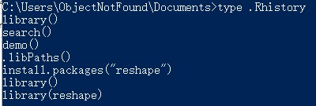

或者用`findstr`结合管道匹配先前程序输出内容中的字符串：

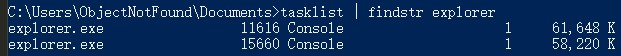

也可以结合正则表达式：

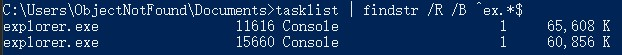

如果你不满足于系统命令的显示效果，你也可以尝试下面两款开源于Github的工具：

<!--more-->

### peco

项目链接：<https://github.com/peco/peco>

`peco`可以实现对管道输入的文本进行快速搜索、排序、多行选择等功能，使用Golang编写。目前仍不支持中文编码（GBK），且不支持默认的Windows PowerShell终端（你需要使用传统的命令提示符，或者更先进的终端程序，比如Hyper或者Windows Terminal）。该项目仍在活跃开发中，合理的使用可以提升效率。

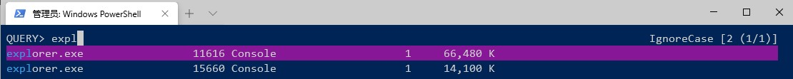

### bat

项目链接：<https://github.com/sharkdp/bat>

`bat`是一款替代`cat`/`type`的工具，使用Golang编写。加入了代码高亮、Git增删标识、不可打印字符显示等功能。

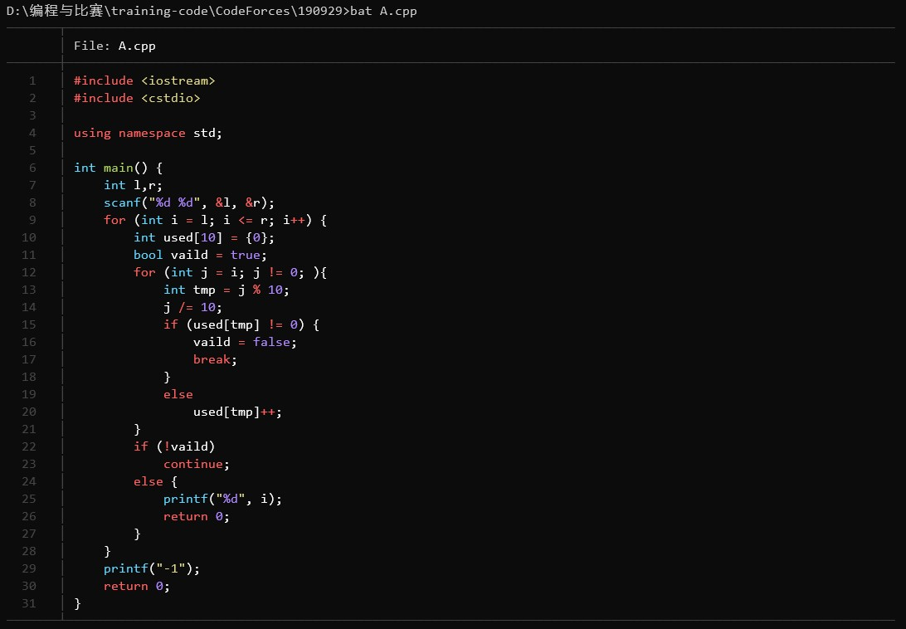

使用参数`-A`可以显示所有不可打印字符：

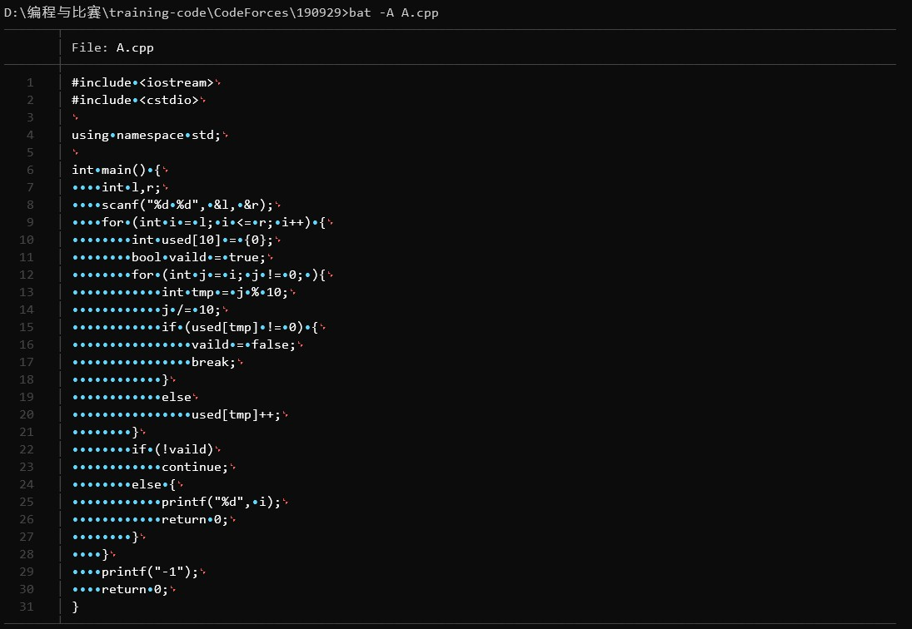

## 软链接、硬链接

### 使用命令行

在Linux下，软链接（即符号链接）和硬链接的使用是非常普遍的。我们经常需要使用`ln`命令来创建它们。

创建硬链接的命令是：

```bash
ln [Target] [Link name]
```

创建软链接，只需要再加上参数`-s`即可。既然是“链接”，那么说明对链接指向的文件进行修改实际上就是对源文件本身进行修改。

硬链接与源文件必须处于同一文件系统内，且源文件必须真实存在。且硬链接的源文件必须是单一文件，不能是目录，因为这样会造成硬链接包含地狱（Hard Link Inclusion Hell）。软链接的源文件则可以是文件，也可以是目录，且无需实际存在。源文件不存在的软链接成为死链接。软链接具有自己的权限与文件属性。软链接可以跨文件系统链接。删除硬链接和软链接均不会对源文件产生影响。

Windows下使用率最高的NTFS文件系统中也有类似的概念，且Windows中也提供了对应的创建链接的命令。

创建软链接的命令是：

```bash
mklink [Link] [Target]
```

这个命令Windows PowerShell中是没有的，因此依然需要使用传统的命令提示符。同时注意，Link和Target的顺序与*nix下的`ln`是相反的（这也导致我总是记错）。如果创建硬链接，加参数`/H`即可。

同时要注意，对于目录的软链接与符号链接有稍许不同。目录符号连接与Linux下的目录软链接基本等同，具有独立的文件属性，在移动时仍保持相对或绝对路径的链接关系，在复制时创建源文件的副本（同Linux下使用`cp`直接复制软链接。Linux下的`cp -d`可以将软链接复制为软链接，而不是将软链接复制为文件）。而Win下的目录软链接在移动时，会在目标位置创建同名文件夹，并把源目录内的所有文件移动至新的目录。

创建目录符号链接的命令：

```bash
mklink /D [Link] [Target Dir]
```

创建目录软链接的命令：

```bash
mklink /J [Link] [Target Dir]
```

### 使用 LinkShellExtension

当然，如果不习惯使用命令行操作，也可以使用第三方工具创建各种类型的软链接和硬链接。

到官网（ <https://schinagl.priv.at/nt/hardlinkshellext/linkshellextension.html> ）下载Link Shell Extension并安装（注：需要Visual C++ 2015 Redistributable运行库，可以到这里（ <https://aka.ms/vs/15/release/vc_redist.x64.exe> ）安装。

随后选择需要创建链接的文件/文件夹，右键，单击“选择源连接点”。

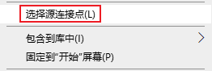

再到目标文件夹右键，从右键菜单中选择需要创建的链接类型就可以了。

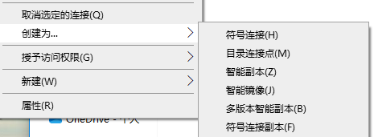

## rm 删除除指定文件外的其他文件

Linux下，删除一个文件/文件夹，或删除该文件夹下所有文件等操作都很简单。但如果想保留文件夹下某一个或某几个文件，同时删除其他文件，该如何操作？

可以结合`ls`、`grep`和`xargs`：

```bash
ls | grep -vE <FileName> | xargs rm -rf
```

这是最传统的方式。你也可以使用一种bash功能，无需借助xargs即可完成这一目的。

```bash
# 开启需要的shell option
shopt -s extglob
# 然后运行！
rm -rf !(<FileName>)
```

`shopt`是bash的内置命令，控制bash的多种可选功能的开启和关闭。bash版本不同，其可选功能也可能不同。

最常用的命令就是：

```bash
# 显示所有支持的可选功能及其状态
shopt
# 开启某个功能
shopt -s <function>
# 关闭某个功能
shopt -u <function>
```

至于每个功能的具体作用，可参见[The Shopt Builtin (Bash Reference Manual)](https://www.gnu.org/software/bash/manual/html_node/The-Shopt-Builtin.html)或[Bash shopt builtin command help and examples](https://www.computerhope.com/unix/bash/shopt.htm)。

以下给出几个较为实用的例子：

### autocd

启用时，bash中直接输入文件夹名的效果等同于执行“cd 文件夹名”。

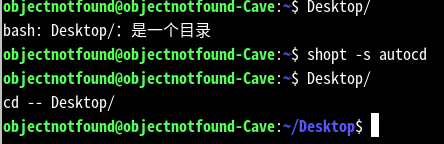

### hostcomplete

启用时，在bash中输入“@”后，按Tab键可补全已知的主机名。

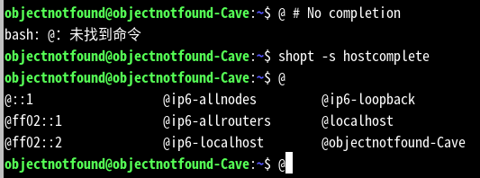

### cdspell

启用时，在bash中使用cd命令，目录名称内字符的错位、字符的缺失（限1个字符）和字符的误加可被自动修正。

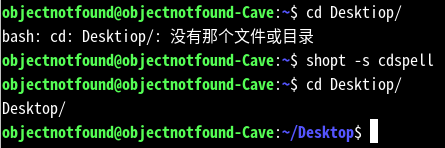

### restricted_shell

进入bash的限制模式。限制模式下无法使用cd命令切换目录、无法修改PATH等变量等。具体的限制可参阅[The Restricted Shell (Bash Reference Manual)](https://www.gnu.org/software/bash/manual/html_node/The-Restricted-Shell.html)。

这种模式不推荐使用shopt进入。推荐的进入方式是直接运行：

```bash
rbash
```

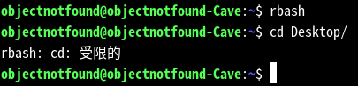

## Windows 展台模式

Windows 10 与 Windows 11 的“展台模式”旨在解决公用电脑存在的痛点。举几个场景的例子：

- 运营一个城市/学校的图书馆。图书馆需要一些公用电脑，供入馆人员查阅图书位置、查询借还情况、显示图书馆的近期公告等。
- 运营Windows系统电脑体验店/专柜。需要在展台上放置屏幕，循环播放设备和品牌的介绍视频/交互式APP等。
- 设置中央大屏。例如工地的考勤状态大屏、信息中心的告警状态大屏、学校的风采展示大屏等等。

这些情况下，Windows展台模式可以很好的兼顾安全性和维护的便捷性。

Windows展台模式具有以下特性：

- **专有用户**，可以设置为开机自动登录。
- 无Explorer环境，**自动运行且只能运行**设定好的“展台程序”。
- **会话超时机制**，一段时间无动作即会恢复初始状态。
- **严格的权限管理**，结合展台应用的应用内限制和读写过滤器，可有效禁止文件修改、第三方程序执行、系统信息获取等可能造成安全风险的行为。

但也要注意，展台应用只能是**UWP应用**或**Microsoft Edge浏览器**。

下面简单描述Windows展台模式的设置方式。系统版本：Windows 10 Enterprise LTSC 2021, Build 19044.1415。

> 注意：最好使用全新安装的、只带有基本驱动程序（例如：安装Intel核心显卡驱动但不安装Intel核心显卡控制面板）和非系统级应用（例如：不安装杀毒软件、虚拟化软件等）的Windows系统。

### （编外：如何给LTSC安装Microsoft Store？）

到[Releases · kkkgo/LTSC-Add-MicrosoftStore](https://github.com/kkkgo/LTSC-Add-MicrosoftStore/releases)下载所需的文件，解压。

右键以管理员权限运行其中的`Add-Store.cmd`。如果之前已经安装过更新版本的`Microsoft.VCLibs`包，则可能会出现错误提示，忽略即可。

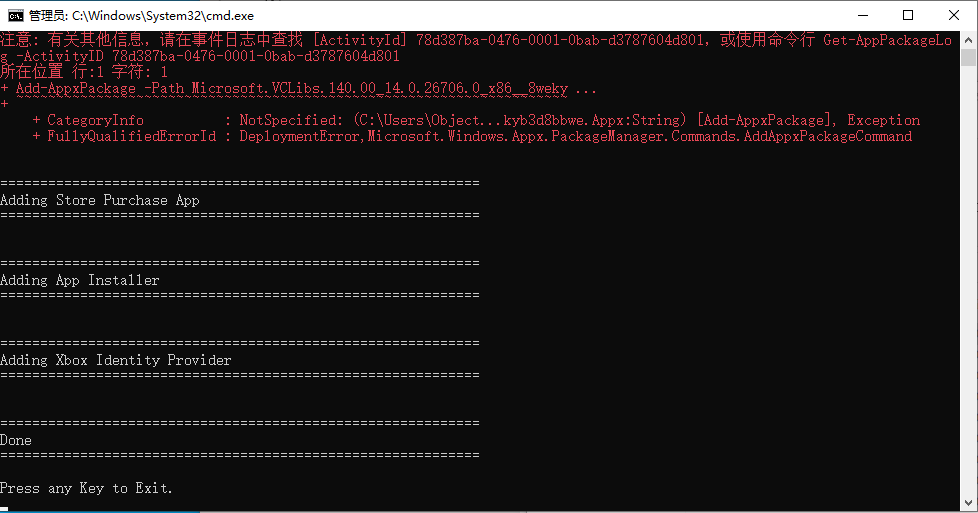

随后即可在开始菜单中看到Microsoft Store：

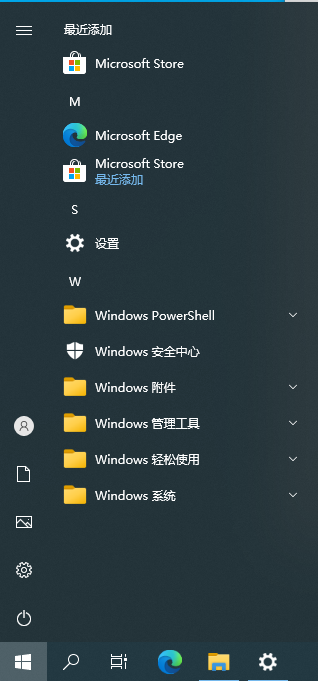

打开Microsoft Store获取更新，即可更新至新版Microsoft Store。

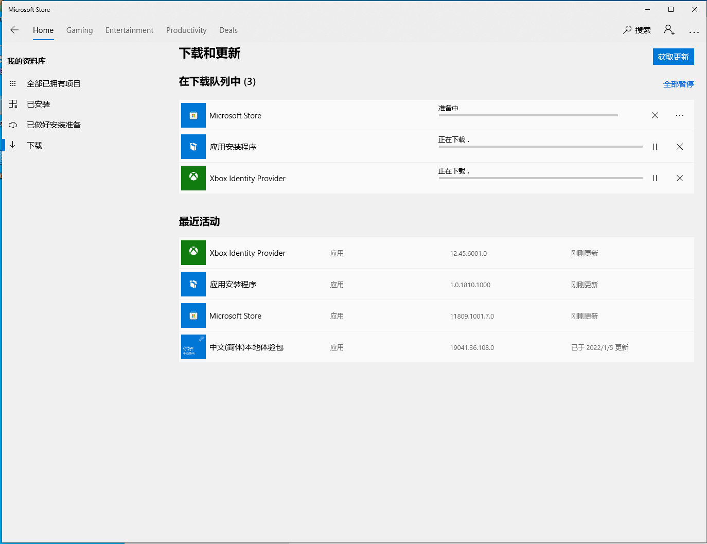


### 设置本地用户

系统设置App -> 账户 -> 家庭和其他用户 -> “将其他人添加到这台电脑”

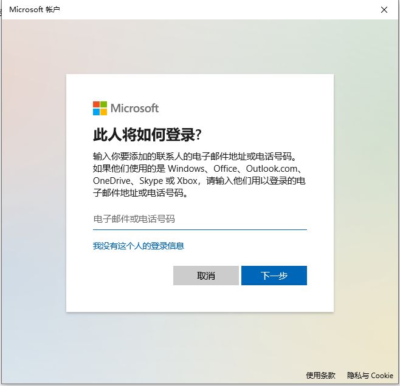

“我没有这个人的登录信息” -> “添加一个没有Microsoft账户的用户” -> 输入用户名，可以不设置密码。用户名此处以“Kiosk”为例。 -> “下一步”

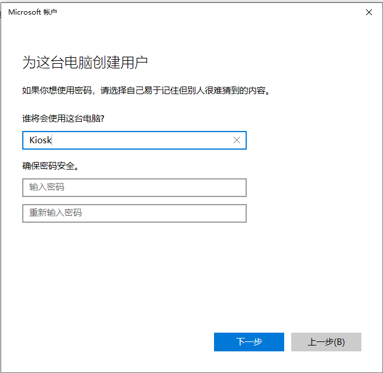

### 登录本地用户

添加完本地用户后，**需要登录一次**以进行用户文件的初始化。


此时确认展台应用（UWP应用或者Microsoft Edge）是否出现在了开始菜单中。若应用有初始化过程，则至少启动应用一次。

之后打开系统设置App -> 账户 -> 登录选项，取消勾选“更新或重启后，使用我的登录信息自动完成设备设置”。

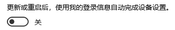

设置完毕后，**注销**这个本地用户，回到之前的管理员用户继续设置。

### 设置展台应用

系统设置App -> 账户 -> 家庭和其他用户 -> 分配的访问权限 -> “开始”。


随后点击“选择现有账户” -> Kiosk -> “下一页”。

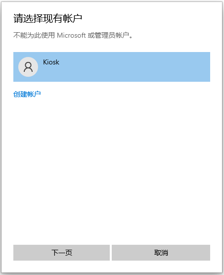

选择展台应用。此处以“Microsoft Edge”为例。

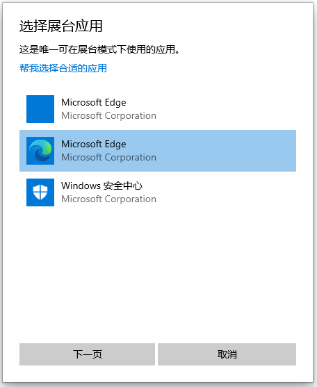

针对不同的App会显示不同的设置选项。此处以针对浏览器的选项“作为公共浏览器”为例。

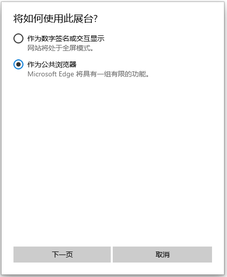

设置Microsoft Edge的默认主页和会话超时时间。会话超时后会强制重启Microsoft Edge，同时删除一切浏览数据。

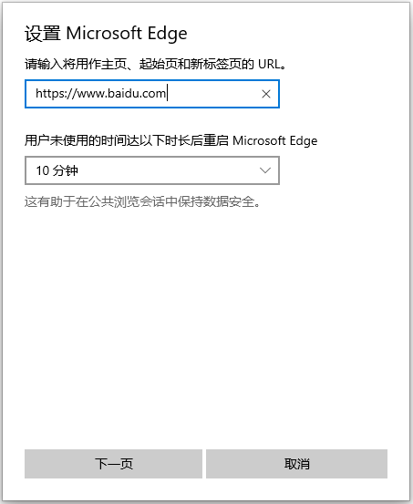

至此，展台模式已设置完毕。在系统设置App中可查看和修改详情。建议取消勾选“当设备崩溃时，不显示错误，并自动重启”选项，避免循环重启。

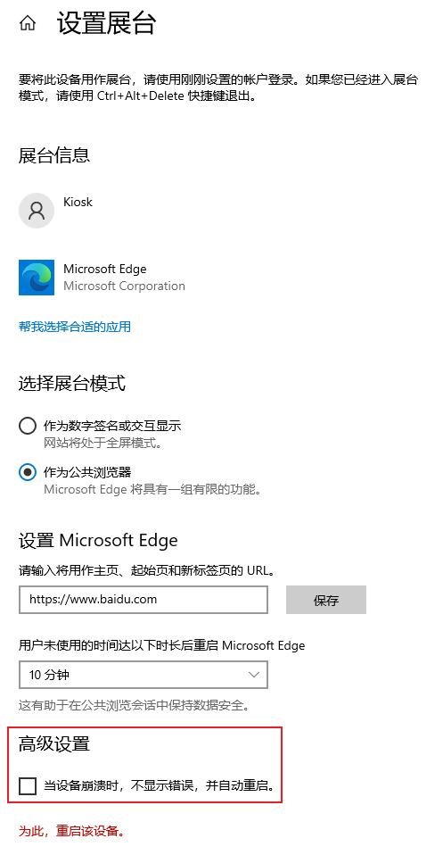

重新启动Windows，登录时选择Kiosk用户即可进入展台模式。

### 补充

- 可以使用`netplwiz`等将展台模式用户设置为自动登录。
- 默认状态下，展台模式的Microsoft Edge右键菜单是受限的。网页内是无法使用右键菜单的，但标签栏可以。Ctrl+C/V的复制快捷键也是不可用的。但部分网页可以触发折叠菜单，此时可以正常复制。

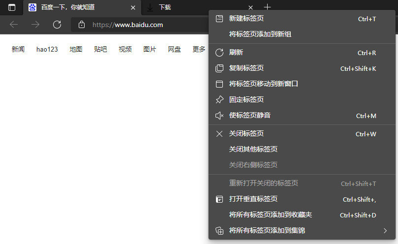

- 默认状态下，展台模式的Microsoft Edge功能是受限的，收藏夹、浏览器设置、开发者工具等都是无法访问的。

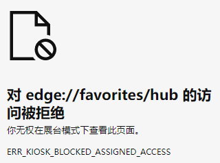

- 默认状态下，展台模式的Microsoft Edge的下载功能和打印功能是可用的，但文件只允许保存至展台用户的Downloads文件夹下。

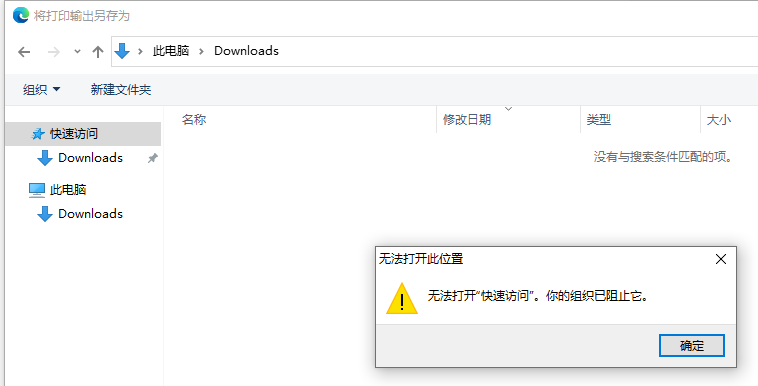

- 默认状态下，展台模式的Microsoft Edge的`file://`协议未被禁止。通过它可以获得完整的文件目录，及读取低权限用户可以读取的部分文件，但无法下载及做出任何修改。

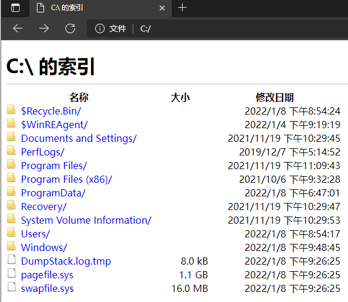

- 点击右上角的“结束会话”，可立即重启Microsoft Edge并删除浏览数据。Downloads文件夹下的文件也会一并删除。


- 默认状态下，展台模式的Microsoft Edge只有一个窗口。
- 更新展台应用时，必须先注销展台用户。注销方法：Ctrl + Alt + Delete唤起用户切换界面 - 登录管理员用户 - 启动任务管理器 - 用户选项卡 - 注销

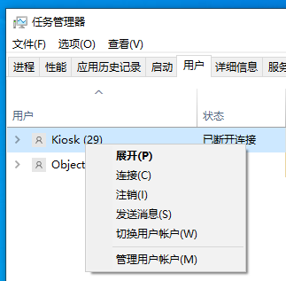

### （编外：启用写入筛选）

写入筛选功能类似数十年前比较流行的“还原卡”的功能：截获驱动器 (应用安装、设置更改、保存的数据) 的写入操作并重定向到虚拟覆盖区。虚拟覆盖区在重新启动等时刻清除，达到“不可对驱动器的文件进行修改”的目的。如果对展台模式的安全性仍有疑虑，可以一并启用写入筛选器提升安全性。

#### 启用功能

写入筛选器功能仅在Windows Enterprise系列系统（企业版、IoT企业版、企业版LTSC等）中提供。

控制面板 - 程序 - 启用或关闭Windows功能 - 勾选“设备锁定 - 统一写入筛选器”。

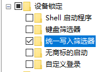

#### 运行和设置

统一写入筛选器是CLI程序，命令为：

```bash
uwfmgr
```

常用命令举例[^1]：

```bash
# 显示当前系统配置
uwfmgr get-config
# 启用写入筛选，重新启动后生效
uwfmgr filter enable
# 设置用于虚拟覆盖区的RAM大小，单位为MB
uwfmgr overlay set-size 1024
# 小内存机器可以利用磁盘空闲空间作为虚拟覆盖区
uwfmgr overlay set-passthrough on
# 设置启用保护的分区
uwfmgr volume protect C:
# 设置排除的目录，全盘保护则不设置
# 同时建议禁用回收站
uwfmgr file add-exclusion C:\Users
# 服务模式，允许安装系统更新，可选项
uwfmgr servicing update-Windows
```

设置完成后重新启动系统即可看到效果。

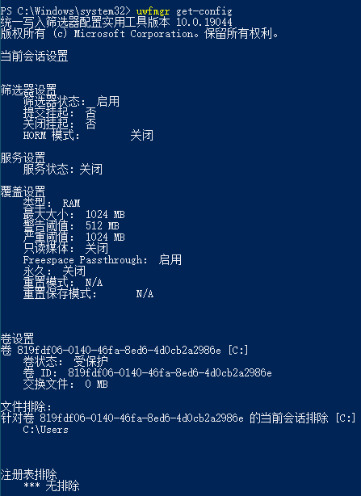

关闭统一写入筛选器，使用如下命令即可：

```bash
uwfmgr filter disable
uwfmgr volume unprotect C:
```

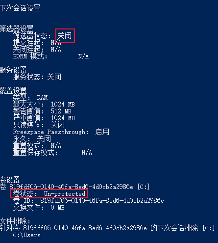


[^1]: 参阅官方文档[Unified Write Filter (UWF) feature (unified-write-filter) | Microsoft Docs](https://docs.microsoft.com/en-us/windows-hardware/customize/enterprise/unified-write-filter)