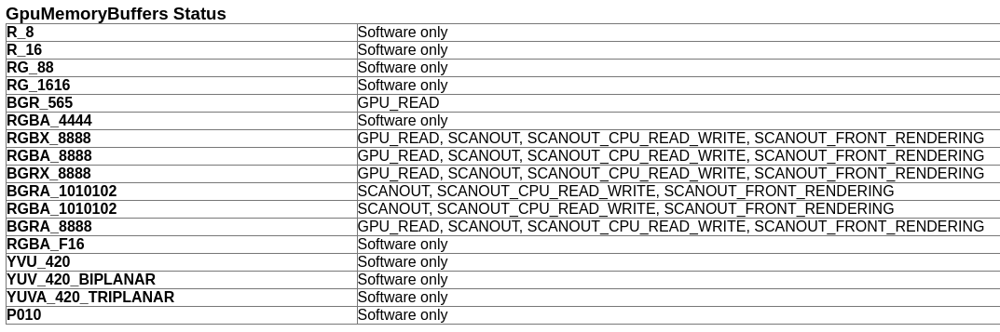
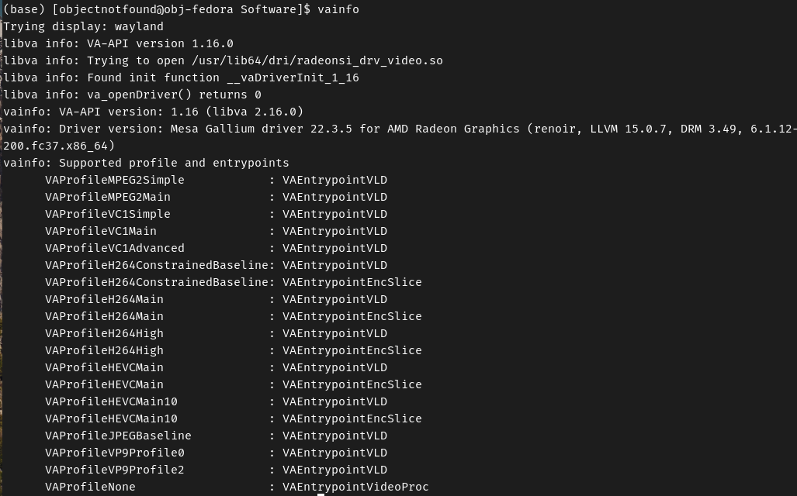
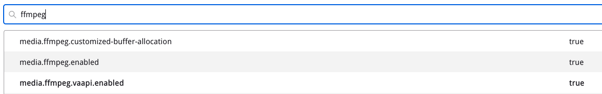
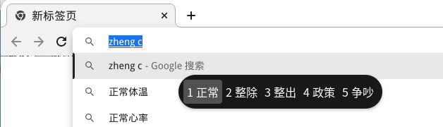

**文章内容：清空iptables，清理docker image，给Wayland下的Chromium/Edge浏览器开启GPU加速**

## 清空iptables规则

使用场景：在需要完全重建iptables规则，或是使用其他软件代替/包装iptables（如firewalld）时。

常见的两种清空iptables规则的方法是：

1. 手动给每一条规则都执行`iptables -D`：
   - 针对默认表，`iptables -D <chain_name> ...`
   - 针对其他表，`iptables -t <table_name> -D <table_name> ...`
2. 查找规则在表的链中是第几条（Line Number），用条目序号进行删除
   - 找条目序号：`iptables [-t <table_name>] -L --line-number`
   - 使用条目序号进行删除：`iptables [-t <table_name>] -D <chain_name> <line_nuber>`

但也可以使用下面的方法批量删除：

```bash
# 如果iptables的默认规则不是ACCEPT，为了防止清除后主机拒绝一切数据包，将所有内置链的默认规则设置为ACCEPT
iptables -P INPUT ACCEPT
iptables -P FORWARD ACCEPT
iptables -P OUTPUT ACCEPT

# 删除所有默认表中的rules
iptables -F
# 删除指定的其他表中的rules
iptables -t <table_name> -F
# 删除默认表中所有user-defined chain（因为此时所有chain均为空）
iptables -X
```

<!--more-->

## 快速删除无用的Docker Image

### docker image prune

Docker提供了可以快速删除无用镜像的命令：

```bash
docker image prune
```

可直接运行，效果：删除所有悬空的（Dangling）镜像

- Dangling Image 指无镜像名或无镜像版本的镜像，比如：`xxx:<none>`、`<none>:xxx`、`<none>:<none>` 均是Dangling Image

- - -

注意：是 `image`，不是 `images`

- `docker images` 只用于查看已拉取的镜像详情
- `docker image` 用于对镜像进行操作

- - -

`docker image prune` 有三个重要参数：

- `-f`：直接执行不确认
- `-a`：除了删除Dangling Image外，还删除未被任何容器使用的镜像
- `--filter`：过滤器，用于选择性删除
  - `--filter until=时间戳`：在该时间戳之前的镜像会被处理
    - `--filter until=48h`：近48小时内的镜像不处理
    - `--filter until=2023-01-01T04:00:00`：在2023/01/01 04:00:00之后的镜像不处理
  - `--filter label=标签名`：有这个标签的镜像才处理
    - `--filter label!=标签名`：没有这个标签的镜像才处理
    - `--filter label=标签名=标签值`，`--filter label!=标签名=标签值`：指定标签的值

### docker container prune

与`docker image prune`类似，但是对容器进行操作：删除所有停止（Stopped）的容器。

```bash
docker container prune
```

有两个参数：

- `-f`：直接执行不确认
- `--filter`：过滤器，用法同`docker image prune --filter`

## Wayland下开启Chromium或Edge浏览器的显卡加速

Firefox在X11和Wayland情况下均默认启用显卡加速。在大多数发行版环境下、在显卡支持时，可硬件解码开放标准的编码（如VP9、AV1等），或 标准版权已过期的商用标准的编码（如H.264等）。如果发行版自带或手动安装了支持有授权限制的编码（如H.265）的VA-API，Firefox也会尝试硬件解码这些编码。

Microsoft Edge与Chromium在X11下均默认启用显卡加速。而在Wayland下，显卡加速仍处于实验状态，需要手动启用。

下面以Fedora 37 + GNOME（Wayland + XWayland）+ Firefox + Microsoft Edge + Chromium为例，给出查看和启用显卡加速的办法。

### 检查是否已启用显卡加速

- Firefox：

  - 访问`about:support`
  - “图像” -> “窗口协议” -> 确认对应的表格内容是为“wayland”
  - “图像” -> “HARDWARE_VIDEO_DECODING” -> 确认对应的表格中没有“unavailable”字样；


<center>Firefox 处于Wayland环境下</center>


<center>Firefox 显卡加速开启状态</center>

- Chromium/Edge：

  - 访问`chrome://gpu`或`edge://gpu`
  - “Driver Information” -> “XDG_SESSION_TYPE” -> 确认对应表格内容是“wayland”
  - “Graphics Feature Status” -> 确认“Video Decode”为“Hardware accelerated”
  - “GpuMemoryBuffers Status” -> 确认所有表格内容**不全是**“Software only”


<center>Chromium 处于Wayland环境下</center>




<center>Chromium 显卡加速开启状态</center>

### 系统环境配置

Firefox及Chromium/Edge的显卡加速均依靠VA-API和VDPAU支持。

- 安装显卡驱动，闭源的官方驱动或是开源的社区驱动均可。
- 安装VA-API和VDPAU工具

```bash
sudo dnf install -y libva libva-utils libvdpau vdpauinfo
```

- 因为法律问题，Fedora等发行版中只提供编码受限的FFmpeg、Mesa VA-API、VDPAU支持包等，因此需要开启RPMFusion

  - 操作流程见 [Configuration - RPM Fusion](https://rpmfusion.org/Configuration)

```bash
sudo dnf install -y https://mirrors.rpmfusion.org/free/fedora/rpmfusion-free-release-$(rpm -E %fedora).noarch.rpm https://mirrors.rpmfusion.org/nonfree/fedora/rpmfusion-nonfree-release-$(rpm -E %fedora).noarch.rpm
```

- 安装FFmpeg

```bash
sudo dnf install -y ffmpeg
# 如果已经安装了ffpmeg-free
sudo dnf swap -y ffmpeg-free ffmpeg
```

- 开源的驱动大概率是基于Mesa图形库开发的。如果你使用的是开源驱动，则需要安装Mesa的VA-API、VDPAU支持包

```bash
sudo dnf install -y mesa-va-drivers-freeworld mesa-vdpau-drivers-freeworld
# 如果已经安装了mesa-va-drivers和mesa-vdpau-drivers
sudo dnf swap -y mesa-va-drivers mesa-va-drivers-freeworld
sudo dnf swap -y mesa-vdpau-drivers mesa-vdpau-drivers-freeworld
```

- 闭源的驱动大概率内置对VA-API、VDPAU的支持，因此无需执行上述命令；有些闭源驱动需要单独安装自己的VA-API和VDPAU支持包，可参考闭源驱动的官方文档；

例如：

```bash
sudo dnf install -y libva-intel-driver
```

- 使用工具检查支持情况

```bash
# 检查VA-API支持情况
vainfo
# 检查VDPAU支持情况
vdpauinfo
```



<center>VA-API支持情况</center>

### 强行开启Firefox硬件加速

- 访问`about:config`
- 搜索`ffmpeg`，将结果中的`media.ffmpeg.vaapi.enabled`改成`true`
- 重启Firefox



<center>设置Firefox高级选项</center>

### 开启Chromium/Edge硬件加速

#### 方法

注意：此方法不适用于无GTK4环境安装的Chromium/Edge浏览器，例如Flatpak。

- 到`/usr/share/applications`下找到`chromium-browser.desktop`或`microsoft-edge-{beta,dev}.desktop`
- 直接修改或复制一个副本进行修改
  - 修改`Name=`方便标识
  - 修改`Exec=`，在原命令的最后面加入如下参数

```bash
# 为方便解释，此处每行一个参数
# 使用系统GL渲染器
--use-gl=egl
# 启用VA-API支持，启用Ozone平台
--enable-features=VaapiVideoDecoder,VaapiIgnoreDriverChecks,UseOzonePlatform
# 设置Ozone平台使用Wayland作为显示服务
--ozone-platform=wayland
# 强制使用GPU光栅化
--force-gpu-rasterization
# 允许进行光栅化的线程直接读写GPU内存
--enable-zerocopy
# Wayland输入法支持
--enable-wayland-ime
# 使用GTK4库
--gtk-version=4
```

- 若在副本中修改，则将副本替换`/usr/share/applications`下的文件，或保存到`~/.local/share/applications`
- 注销当前用户，重新登录（使GNOME重新读取所有Desktop entry）
- 使用修改后的Desktop entry启动Chromium/Edge

#### 输入法不能用，如何解决？

- 方法一：安装GNOME扩展[Input Method Panel](https://extensions.gnome.org/extension/261/kimpanel/)，即可正常使用输入法



- 方法二：可以使用Chrome扩展[Google 输入工具](https://chrome.google.com/webstore/detail/google-input-tools/mclkkofklkfljcocdinagocijmpgbhab?hl=zh-CN)，代替系统输入法

