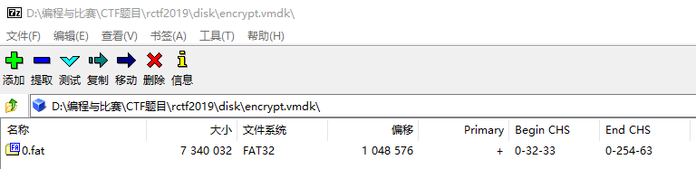
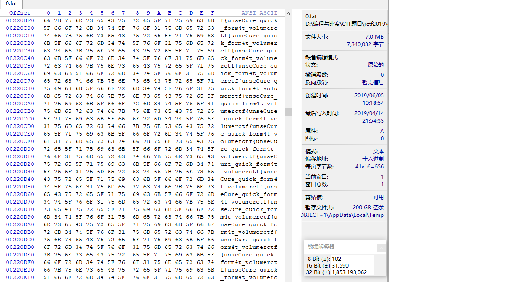
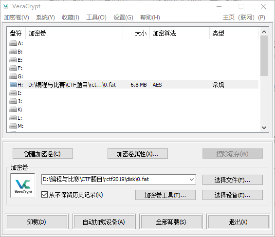
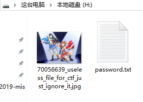
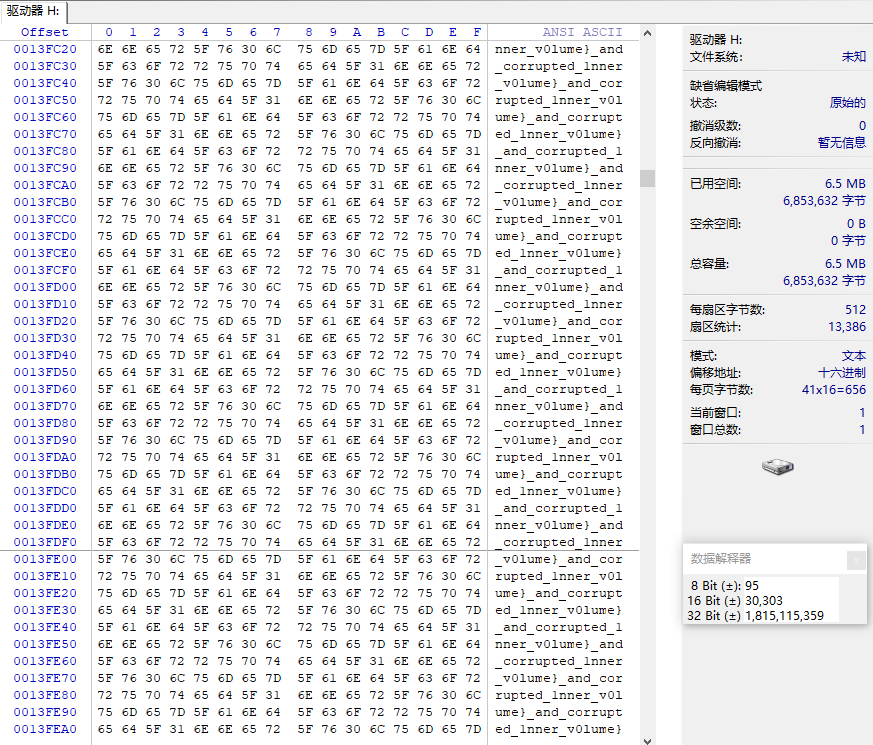

我又来随便糊一篇文章了。

题目设定如下：

> An otaku used VeraCrypt to encrypt his favorites.
>
> Password: `rctf`
>
> Flag format: `rctf{a-zA-Z0-9_}`

题目给的提示十分简单。于是准备 VeraCrypt，开始解题。

### 找前半段Flag

首先下载题目附件，得到 rctf-disk.zip，解压得到 encrypt.vmdk。因为无法确定 vmdk 是 VeraCrypt 加密完的虚拟硬盘文件随便改了个格式，还是存储了 VeraCrypt 加密后虚拟磁盘文件的虚拟磁盘（这话真的超级绕hhh），因此先尝试使用 7zip 打开该文件。



<center>7zip可以成功打开</center>

<!--more-->

说明外层的 vmdk 只是容器，并没有加密。将 0.fat 解压出来，再次尝试用 7zip 打开，报错，说明 vmdk 中包含的这个 FAT32 分区被加密了。使用 WinHex 载入这个文件可以看到：



<center>前半段Flag</center>

这样我们就得到了前半段 Flag，为：`rctf{unseCure_quick_form4t_vo1ume`

### 找后半段Flag

使用题目中所给的 VeraCrypt 密码对 0.fat 文件进行解密并加载，发现加载成功，为常规卷，加密类型为 AES。



<center>成功加载加密盘</center>

访问该磁盘，文件如下：



<center>加密盘内文件</center>

注意左侧文件的文件名 `70056639_useless_file_for_ctf_just_ignore_it.jpg`，说明其不包含解题的有效信息。于是打开 `password.txt`，文件内容为：

```text
Password 2: RCTF2019
You're late... So sad
```

将此加密盘卸载，使用得到的第二个密码再次加载，加载成功。加密方式是 AES，但是注意该分区是隐藏分区。


<center>第二次加载成功</center>

由于是隐藏分区所以无法直接访问。因此使用 WinHex 载入磁盘，提示无法自动检测分区格式后选择“分区无格式”，并查看该分区扇区数据（DiskGenius 查看磁盘扇区数据也可以）。



<center>后半段 Flag</center>

得到后半段 Flag：`_and_corrupted__1nner_v0lume}`

拼接后得到完整的 Flag：

```text
rctf{unseCure_quick_form4t_vo1ume_and_corrupted_1nner_v0lume}
```