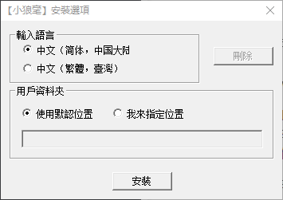
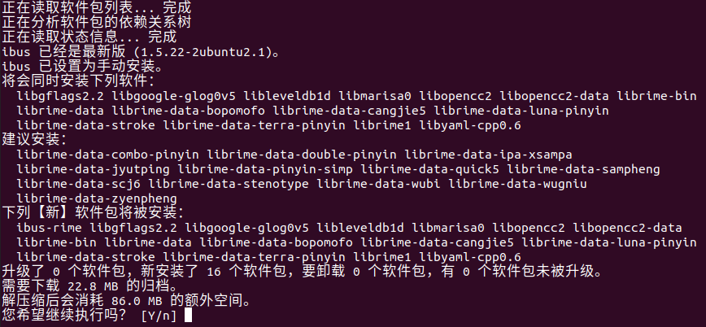
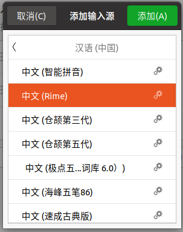
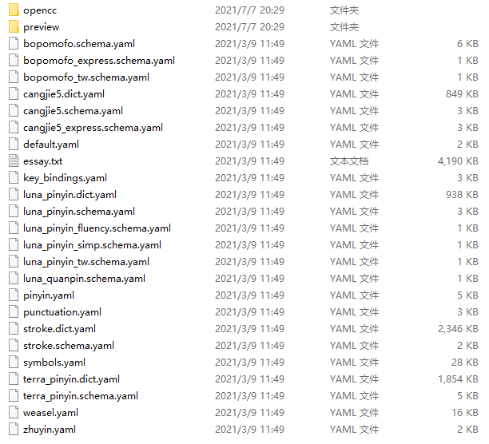
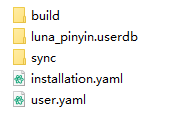
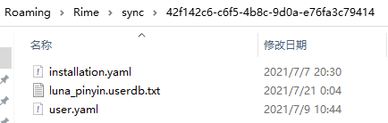
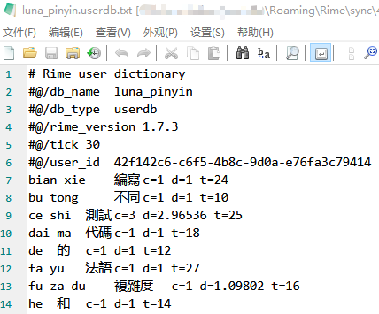

## 什么是 Rime？

RIME，官方中文名称为“中州韻”（即“中州韵”，中原之韵），是一款开源的轻量的跨平台输入法库，由佛振等人开发。源代码现托管在 Github 上：[rime/librime](https://github.com/rime/librime)。Rime 具有很强的扩展性和可定制性——你可以使用 Lua **编写它的插件**，也可以通过自定义配置文件实现自己研发的、更加高效的**汉字输入方案**，或者实现**多语言混合输入**，又或者你只是想在各个平台上获得**统一的文字输入体验**。这一特性使得强大的 Rime 在使用上拥有无限的可能性。本文是 Rime 系列的第一篇，主要记录 Rime 在各个平台下的安装，及其基础的使用方法。

## 如何安装 Rime？

Librime 是一个开源的输入法库。库像是一种“后端”，不能直接用于文字输入。需要和配套的“前端”（也称“发行版”）一起使用。“前端”也已有不少实现，列举使用人数较多的输入法“前端”如下：

* [rime/squirrel](https://github.com/rime/squirrel)，中文名为“鼠须管”，macOS 下的输入法前端；
* [rime/weasel](https://github.com/rime/weasel)，中文名为“小狼毫”，Windows 下的输入法前端；
* [osfans/trime](https://github.com/osfans/trime)，中文名为“同文输入法”，Android 下的输入法前端；
* [jimmy54/iRime](https://github.com/jimmy54/iRime)，中文名为“iRime输入法”，iOS 下的输入法前端，注意有应用内购付费，而且有人反映其并未严格按照Rime的规范加载配置文件；
* [rime/ibus-rime](https://github.com/rime/ibus-rime)，Linux 下的输入法前端，基于 IBus；
* [fcitx-rime](https://github.com/fcitx/fcitx-rime)，Linux 下的输入法前端，基于 Fcitx；

或者你也可以利用librime，编写自己的输入法前端。

<!--more-->

### Windows - Weasel

Weasel可以直接在Rime的官网下载安装，也可以手动编译安装。截止本文写作之时，Rime官方发布的稳定版本为0.14.3，采用librime 1.5.3版本，更新于2019年6月22日。而librime的最新版本已迭代至了1.7.2，修复了不少错误并且向后兼容。因此强烈推荐手动编译新版本并安装。

编译所需环境：

* Visual Studio 2017
* Boost 1.69.0
* CMake
* NSIS
* Git、7z、Wget for Windows等常见工具

下面简单叙述步骤。

第一步：Clone项目，下载并更新子模块为最新。

```bash
git clone --recursive https://github.com/rime/weasel.git
cd weasel\
git submodule update --remote --recursive
```

第二步：修正NSIS配置文件错误。找到`output\install.nsi`，修改第159行的：

```
File "data\opencc\*.ocd"
```

为：

```
File "data\opencc\*.ocd2"
```

这是因为新版本的opencc使用ocd2作为字典格式，而不是老版本的ocd格式。

第三步：设置环境变量。包括编译器版本、工具集、Boost位置、librime编译成品的版本号（可从[librime的Release页](https://github.com/rime/librime/releases)查询）、下载链接等。根据实际情况和版本需要进行修改。

如果你不想通过命令行下载librime，也可使用浏览器下载后，参照第四步所述命令手动将所需文件放置于指定位置。

```bash
set BOOST_ROOT=C:\Libraries\boost_1_69_0
set CMAKE_GENERATOR="Visual Studio 15 2017"
set PLATFORM_TOOLSET=v141_xp
set rime_version=1.7.3
set rime_variant=rime-with-plugins
set download_archive=%rime_variant%-%rime_version%-win32.zip
set WEASEL_BUILD=20210309
```

推荐下载支持Lua插件扩展的rime-with-plugin版本。

第四步：下载编译好的librime并复制文件。

```bash
wget https://github.com/rime/librime/releases/download/%rime_version%/%download_archive%
7z x %download_archive% * -y -olibrime
copy /Y librime\dist\include\rime_*.h include\
copy /Y librime\dist\lib\rime.lib lib\
copy /Y librime\dist\lib\rime.dll output\
if not exist output\data\opencc mkdir output\data\opencc
copy /Y librime\thirdparty\share\opencc\*.* output\data\opencc\
```

第五步：编译Boost环境。直接使用为AppVeyor编写的编译脚本即可。

```bash
.\appveyor_build_boost.bat
```

第六步：编译主程序。

```bash
.\build.bat data hant weasel installer
```

随后在output文件夹中即可找到编译完成的安装文件。双击进行安装即可。

安装时会弹出设置选项：



用户资料夹即为下文提到的“用户资料路径”，如果你想直接开始使用，选择默认方案为“中文（简体）”就可以了。

安装完成后，需要留意以下三个路径：

- 默认数据路径：默认为`C:\Program Files (x86)\Rime\weasel-$版本号`
- 用户数据路径：默认为`C:\Users\$用户名\AppData\Roaming\Rime`
- 同步路径：默认为`C:\Users\$用户名\AppData\Roaming\Rime\sync\$安装ID`

这两个路径对后续Rime的配置有很大用处。

### Linux - Ibus-rime

Linux下的前端有两个，一个是基于Fcitx的fcitx-rime，既支持Fcitx 4，也支持新开发的Fcitx 5。但缺点是**无法同步输入法的用户数据**。另一个是基于的Ibus的ibus-rime，可以同步输入法的用户数据。以下以Ubuntu环境为例，配置ibus和ibus-rime。

安装十分简单，ibus已包含于官方源中：

```bash
sudo apt install ibus ibus-rime
```



安装完毕后重启系统，打开设置-区域与语言-输入源-加号（+），在弹出的窗口中选择汉语（中国）-中文（Rime），点击添加。



随后在任务栏右上角切换输入法即可激活ibus-rime。

当然你也有可能遇到ibus在某些应用程序中不可用的问题，一般只要在`~/.bashrc`中加入如下的设置环境变量命令即可。

```bash
export GTK_IM_MODULE=ibus
export XMODIFIERS=@im=ibus
export QT_IM_MODULE=ibus
```

注意：有些发行版的ibus-rime在安装时会附带依赖librime-data，其中包含了rime默认的输入方案，如朙月拼音、仓颉、五笔等，可“开箱即用”。但由于不是所有发行版都有这种依赖，后文的基本配置环节将建立在无默认输入方案的基础之上。

对于ibus-rime来说，三个重要路径如下：

- 默认数据路径：`/usr/share/rime-data`
- 用户数据路径：`~/.config/ibus/rime`
- 同步路径：`~/.config/ibus/rime/sync/$安装ID`

### Android - Trime

至对应的GitHub Repo或Google Play上搜索“同文輸入法”下载安装即可。随后在Android的设置-语言与输入法-输入法管理中启用输入法即可。

同文输入法同样也附带了rime的默认输入方案，如果你对输入方案和词库没有要求的话，同样可以“开箱即用”。

对于Trime来说，三个重要路径如下：

- 默认数据路径：`/sdcard/rime`
- 用户数据路径：默认情况下与系统数据一致
- 同步路径：`/sdcard/rime/sync/$安装ID`

## Rime默认配置文件的简单介绍

### 默认数据

这里以小狼毫为例，简单来看一下rime默认附带的配置文件都有什么。默认数据的存放位置是安装目录下的`data`文件夹。



从上到下依次进行介绍：

* `opencc`：开放中文转换（OpenCC）库需要的文件。一般也称OpenCC“滤镜”。存放着滤镜的配置文件（json）和滤镜本体（ocd或ocd2）
* `preview`：皮肤的预览图，应为小狼毫特有的文件夹。
* `*.sechma.yaml`：输入方案的配置文件，yaml格式。对输入法的行为进行了定义。图中涵盖了这些默认方案：
  * `bopomofo`：注音输入法。
  * `bopomofo_express`：注音输入法的快打模式。快打模式会对输入法行为进行调整，如自动上屏（即自动将唯一匹配的候选词进行输出）、特殊键位（如大写锁定键作为候选词的切换键）等。
  * `bopomofo_tw`：为台湾正体优化的注音输入法。实际上就是默认启用了注音输入法中加载的台湾字形滤镜。
  * `cangjie5`：第五代仓颉输入法。
  * `cangjie5_express`：仓颉输入法的快打模式。
  * `luna_pinyin`：朙月拼音。这会是我们后续进行定制的基础输入方案。
  * `luna_pinyin_fluency`：朙月拼音语句流模式。空格作为分词，一次可打多个词。
  * `luna_pinyin_simp`：朙月拼音的中文简体模式。
  * `luna_pinyin_tw`：朙月拼音的台湾正体模式。
  * `luna_quanpin`：全拼输入法。一般作为调试用途。
  * `stroke`：五笔输入法。
  * `terra_pinyin`：地球拼音输入法。
* `*.dict.yaml`：对应输入方案的输入法词库。“候选词”中的大部分来源于此。
* `default.yaml`：主配置文件，涵盖包括输入法方案的禁用和启用、候选词个数、键位绑定等配置。
* `essay.txt`：“八股文”，预设词汇表和语言模型。
* `weasel.yaml`：输入法前端配置文件，包含了与前端相关的配置，如界面字体、界面颜色等。不同的前端配置文件名称不同（也可能没有该配置文件），如同文输入法的前端配置文件为`trime.yaml`。
* `pinyin.yaml`：拼音输入法的模糊音配置。
* `punctuation.yaml`：定义了基本的全角符号和半角符号。
* `symbol.yaml`：定义了几乎所有常见的符号，除标点外还包括序号、上下标、希腊字母、片假名等。
* `key_bindings.yaml`：额外的快捷键定义。
* `zhuyin.yaml`：将拼音码表与注音码表相互转换。这样输入注音时就可从拼音词库中查词。是输入方案`bopomofo`的依赖项——不难发现`bopomofo`并没有自己的词库，而是与`terra_pinyin`共用词库。

### 默认用户数据

同样以小狼毫为例，简单看一下默认的用户数据都包括些什么。用户数据存储于安装时指定的用户资料夹位置下。如果你还没有开始使用小狼毫打字，目录下的文件是这样的：


如果你已经用小狼毫打过字，并触发过用户资料同步，那么目录下的文件看起来像这样：



依次进行介绍：

- `installation.yaml`：保存了“前端”与“后端”的安装信息，如“前端”名称、librime版本号、**安装ID**等。
- `user.yaml`：存放用户变量，如最后一次同步时间的时间戳等。
- `sync`：是默认的用户数据同步文件夹。
- `*.userdb`：是对应的输入方案的词频/排序/个人词典数据库。
- `build`：存放词库与输入方案编译后的yaml文件和二进制文件。
- `*.schema.yaml`、`*.dict.yaml`等：输入法的输入方案及其对应的词库。**相同名称的输入方案/词库配置会替代默认数据目录下的输入方案/词库配置**，也即用户数据的优先级高于默认数据。

如果你触发过同步，可以在默认的同步文件夹下看到同步后的文件。



依次进行介绍：

- `user.yaml`、`installation.yaml`、`*.schema.yaml`、`*.dict.yaml`等：与**用户数据文件夹**下的内容一致。**仅在默认数据目录中而不在用户数据目录中的文件不会被同步**。
- `*.userdb.txt`：输入方案的数据库的导出文件，按特定格式明文保存。这也是后续构建个人词库的词条来源。



对目录结构和文件作用有了基本了解之后，我们就可以着手定制自己的输入方案了。
