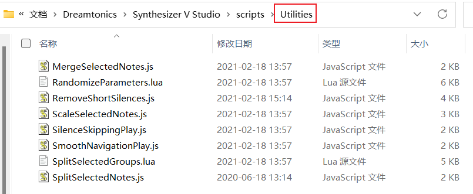
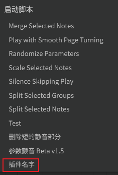
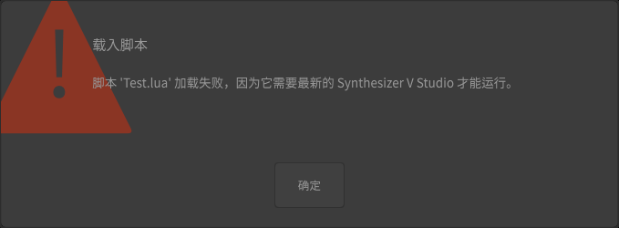
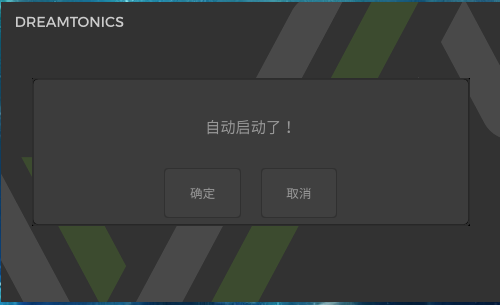
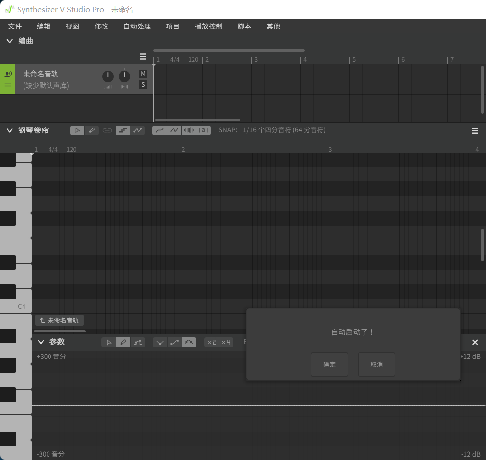
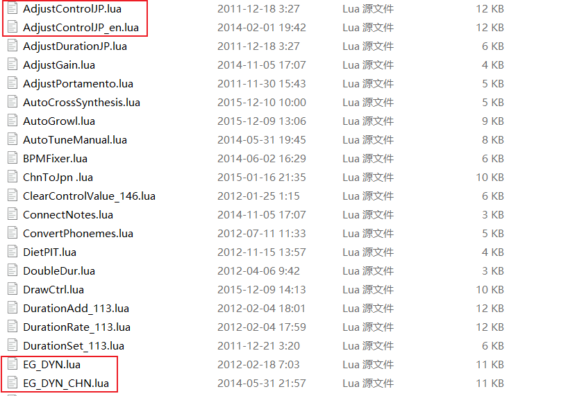
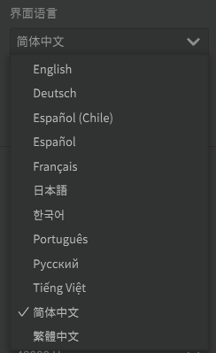
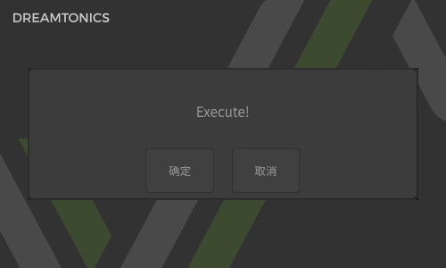
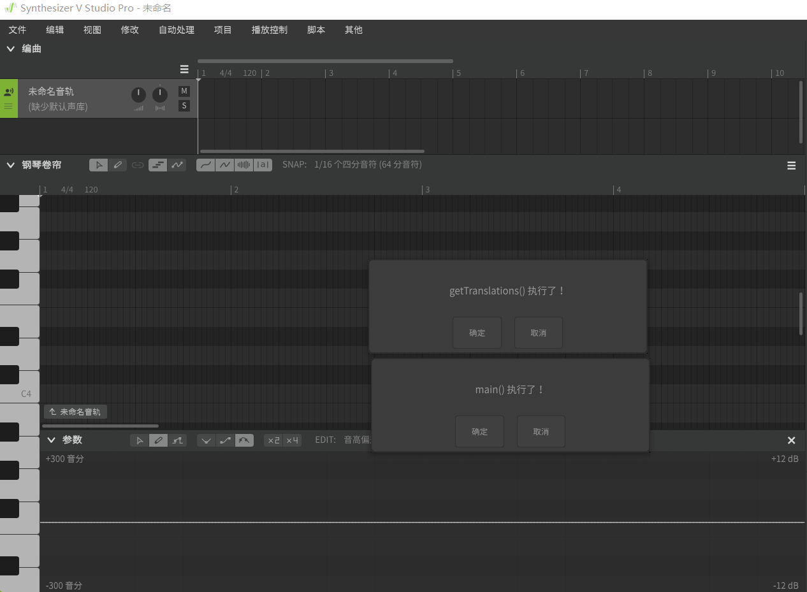

## 写在前面

本文并非“零基础入门”型的文章。阅读此文章前，建议你已经：

- 使用过 Synthesizer V Studio（即 SVR2，以下用此简称代替），了解过 VOCALOID，知道“插件”的作用是什么；
- 已购买 Synthesizer V Studio Pro 版本，以便于插件的开发与调试；
- 有一定的编程经验，使用过 Lua 语言；

Synthesizer V Studio Pro的正版授权可从 [平行四界官方淘宝店 ](https://m.tb.cn/h.flbJg4X?tk=LPeC22VB8ru)或 [Dreamtonics官方淘宝店](https://m.tb.cn/h.fObZTTm?tk=cthk22VzyWK) 获取。关于 Lua 编程的资料数不胜数，可从 [菜鸟教程 ](https://www.runoob.com/lua/lua-tutorial.html)等网站获取。

另外，阅读时，可以配合下面两个文档：

- [Home - Synthesizer V Studio Scripting Manual](https://resource.dreamtonics.com/scripting/)，官方的 Synthesizer V 插件 API 文档；
- [Synthesizer V Studio 用户手册](https://synthesizer-v-r2-docs.vercel.app/)，由 磷元素P 大佬翻译的 Synthesizer V 使用手册和插件 API 文档；

正文部分存在问答部分，可能与后文的知识关联。你可以按顺序阅读，也可以在阅读完其他内容后再阅读问答部分。

以下是文章正文。

<!--more-->

## 脚本存放位置

SVR2 的软件数据默认保存在“我的文档”下，而脚本放置在其中的“scripts”子目录中。

以 Windows 系统为例，如果你没有移动过“我的文档”位置，那么路径应该是：

```
C:\Users\<你的用户名>\Documents\Dreamtonics\Synthesizer V Studio\scripts
```

你可以在其中创建子目录分类存放不同种类的脚本。SVR2 安装时附带的插件默认放置在“Utilities”子目录下。



## 插件的基本结构

SVR2 Pro 支持两种插件格式：JavaScript 插件，使用嵌入式的 [Duktape](https://duktape.org/) 解释器；以及 Lua 插件，使用嵌入式的 Lua 5.4解释器。这里选择 Lua 作为编程示例语言，以便有 VOCALIOID 插件开发经验的人快速转向 SVR2 的插件开发。

SVR2 插件在结构上主要有以下几个部分：

- 插件信息函数：`getClientInfo()`
- 本地化函数：`getTranslations()`
- 入口点函数：`main()`

下面分别进行说明。同时注意，SVR2 软件在启动时会将所有的插件代码载入内存（但不会执行除 `getClientInfo()` 和 `getTranslations()` 外的其他部分），因而对插件代码做出的改动需关闭 SVR2 再启动 SVR2 才可生效。

### 插件信息

插件信息由函数 `getClientInfo()` 控制。作用与 VOCALOID 的 JobPlugins 中 `mainfest()` 函数的作用类似，保存插件的名称、维护者、兼容性等信息。

其结构如下：

```lua
--[[
    @function getClientInfo 插件信息函数
    @param nil 无参数
    @return table 返回列表
    @field name string 插件名字
    @field author string 插件作者
    @field versionNumber num 插件版本
    @field minEditorVersion num 最低版本要求
--]]
function getClientInfo()
    return {
        name = '插件名字',
        author = '作者信息',
        versionNumber = 1,
        minEditorVersion = 65540
    }
end
```

其中：

- `name`：字符串，为插件的名称。会作为 SVR2 软件中“脚本-启动脚本”菜单中的显示名称。可以使用本地化字符串（将在后文讲解）。



- `author`：字符串，为插件的作者信息，仅起提示作用，不会显示在软件中。同样可以使用本地化字符串。

- `versionNumber`：数字，为插件的版本号，仅起提示作用，目前在 SVR2 内不会产生任何动作。
- `minEditorVersion`：可使用该插件的最低 SVR2 版本号。SVR2 的版本号为 **6 位 16 进制数字**。例如：1.4.0 版本对应的版本号为 `0x010400`。上述例子中的版本号 `65540` 转为 16 进制得 `0x010004`，对应 SVR2 版本 1.0.4。若该值大于当前使用的 SVR2 版本号，则会触发错误提示。



> 问：既然 SVR2 会在启动时执行 `getClientInfo()`，那么是否可以在这个函数中添加其他的语句实现“随 SVR2 启动而自动执行”？

答：**是可以的，但过程不能阻塞**。阻塞会使 SVR2 卡在启动画面。来看一个有点超纲的例子：

```lua
function getClientInfo()
    -- 定义窗口
    local form = {
        title = '自动启动了！'
    }
    -- 使用阻塞函数展示窗口
    SV:showCustomDialog(form)
    return {
        name = 'Haha',
        author = 'Test',
        versionNumber = 2,
        minEditorVersion = 0x010004
    }
end
```

启动 SVR2 后的效果：





此处插件伴随 SVR2 的启动而自动启动了。关于插件是如何定义和显示 GUI 的，将在后文讲解。

### 本地化

SVR2 内置多种界面语言，而插件的本地化功能可以使插件可根据 SVR2 界面语言的不同使用不同的字符串。这样一来，插件的翻译和更新都变得更加容易。VOCALOID 无此功能，因此在分发 VOCALOID 插件时经常需要同时分发多个翻译版本。



插件的本地化由函数 `getTranslations()` 控制。

其基本结构如下：

```lua
--[[
    @function getTranslations 本地化函数
    @param langCode string 语言代码
    @return table 返回字符串列表
--]]
function getTranslations(langCode)
    if langCode == 'zh-cn' then
        return {
            {'Hello', '你好'}
        }
    end
end

-- 使用本地化字符串
local testStr = SV:T('Hello')
```

其中：

- `en-us`：字符串，为语言代码，由形参 `langCode` 给出。更多的语言代码可在 [Language designators with regions](https://lingohub.com/developers/supported-locales/language-designators-with-regions) 查看。常见的语言代码：
  - 中文简体：`zh-cn`
  - 中文繁体：`zh-tw`
  - 英语：`en-us`
  - 日语：`ja-jp`



- `return`：return的是一个二层嵌套的表。每一个子表都是如下形式：

  ```lua
  {'默认语言下的字符串', '目标语言下的字符串'}
  ```

  - 默认语言下的字符串：当 `getTranslations()` 函数中对 `langCode` 的条件判断均不满足，无 `return` 时，将使用该字符串。本例中，“默认语言下的字符串”是英语“Hello”。当 SVR2 的语言是日语（ja-jp）时，字符串仍将使用“Hello”。
  - 目标语言下的字符串：当 `getTranslations()` 函数中对 `langCode` 的条件判断满足且 `return` 二层链表时，将使用该字符串。本例中，若 SVR2 的语言是中文（zh-cn）时，字符串将使用“你好”。

- `SV:T()`：使用本地化字符串。按照上述规则返回默认语言下的字符串或目标语言下的字符串。

> 问：既然 SVR2 也会在启动时执行 `getTranslations()`，那么是否也可以在这个函数中添加其他的语句实现“随 SVR2 启动而自动执行”？

答：**是可以的，但过程依然不能阻塞。**阻塞的过程会使 SVR2 卡在启动界面。

也需同时注意它与 `getClientInfo()` 间的区别：

- **不能使用 SVR2 提供的同步的 GUI 相关函数**，只能使用其异步版本。同步的 GUI 函数会使插件从插件列表中消失。（可能是Bug？）

  例子如下：

  ```lua
  function getTranslations(langCode)
      local form = {
          title = 'Execute!'
      }
      -- 非阻塞的 GUI 函数
      SV:showCustomDialogAsync(form, nil)
      -- 照常 return 翻译
      if langCode == 'zh-cn' then
          return {
              {'Plugin Name', '插件名字'}
          }
      end
  end
  ```

  对同步和异步的 GUI 函数的细节将在后文描述。



- **每次插件启动都会执行 `getTranslations()`，而 `getClientInfo()` 只会在 SVR2 启动时执行一次**。搭配这两个函数可以实现复杂的插件自动启动过程。

  一个稍微超纲的例子如下：

  ```lua
  function getTranslations(langCode)
      local form = {
          title = 'getTranslations() 执行了！'
      }
      SV:showCustomDialogAsync(form, nil)
      if langCode == 'zh-cn' then
          return {
              {'Plugin Name', '插件名字'}
          }
      end
  end
  
  -- 入口点
  function main()
      local form = {
          title = 'main() 执行了！'
      }
      SV:showCustomDialog(form)
      SV:finish()
  end
  ```
  
  从 SVR2 的“脚本”菜单中启动插件，效果如下：
  

  
  在顺序上，`getTranslations()` **优先于** `main()` 被执行。
  
- **`getTranslations()` 中不能使用 `SV:T()`。**使用 `SV:T()` 不会报错，但始终返回默认语言下的字符串。

> 问: 既然 `getClientInfo()` 与 `getTranslations()` 都会在启动时被执行，那么它们的先后顺序是什么？

答：`getTranslations(langCode)` **优先于** `getClientInfo()` 被执行。

### 入口点

就像C语言程序需要 `int main()` 作为入口点才能编译为独立的直接运行的程序一样，插件也有类似的入口点函数 `main()`。

其结构如下：

```lua
--[[
    @function main 入口点函数
    @param nil 无参数
    @return nil 无返回值
--]]
function main()
    -- 此处放置代码
end
```

该函数只会在插件从“脚本”菜单中启动时被执行。

## 插件界面

界面是插件的一个重要组成部分。用户通过界面了解插件的作用、通过界面提供和调整插件所需的参数、通过界面获取插件的各种提示信息等。

SVR2 提供了两套显示 GUI 的函数：同步的函数和异步的函数。所有函数均是宿主对象 `SV` 的方法。

### 宿主对象

对象 `SV` 就是宿主对象（Host Object）。宿主对象保存了当前宿主（即正在运行的 SVR2 软件）内的部分数据（如软件信息、播放状态、音符状态等）。SVR2 为了方便开发者，还在 `SV` 对象的父类中定义了许多的工具函数（如频率与音名互相转换、时间单位互相转换等，在后文详细说明）。

宿主对象的父类会在 SVR2 启动时被实例化。同一时间运行的两个 SVR2 中的宿主对象相互独立。