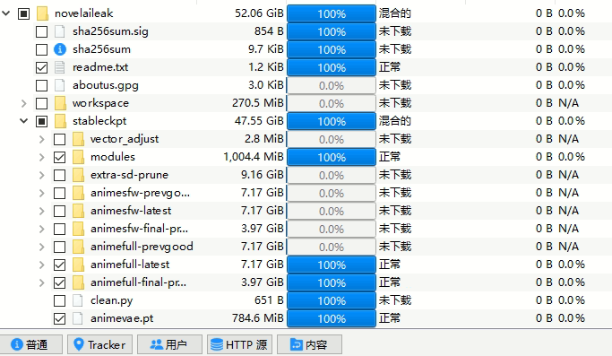
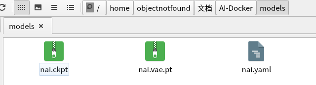
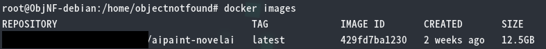
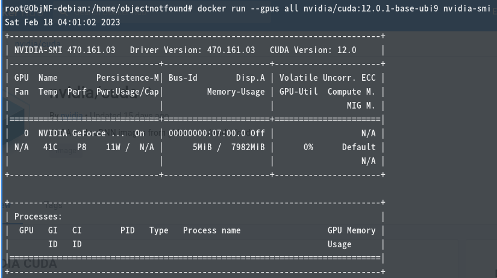
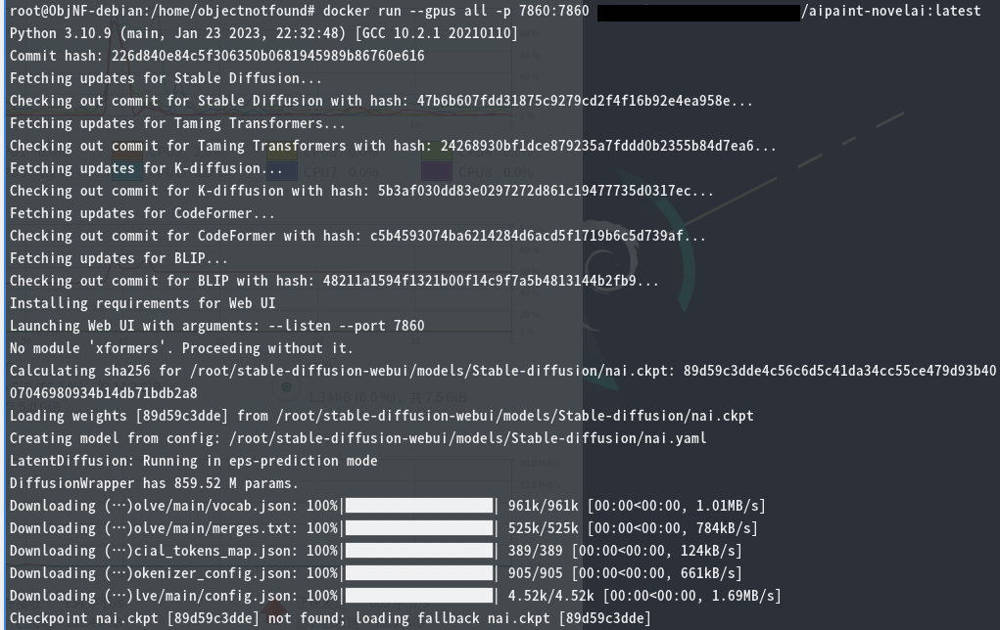
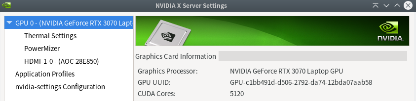
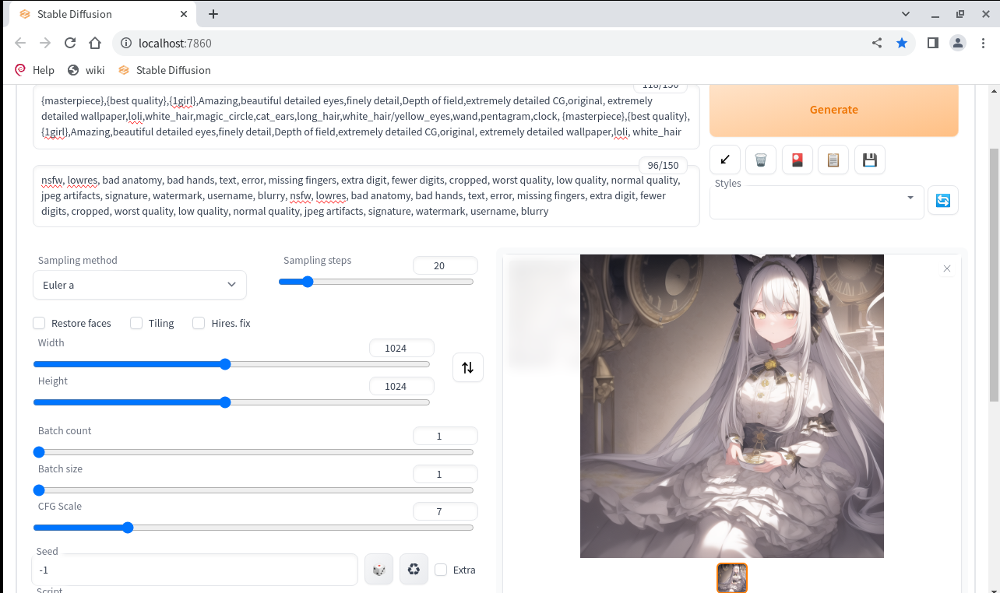

## 准备 Novel AI 模型文件

下载地址：

```text
magnet:?xt=urn:btih:5bde442da86265b670a3e5ea3163afad2c6f8ecc
```

只需要部分下载其中的文件；

- 必须的文件：
  - 文件  `stableckpt/animevae.pt`
  - 文件夹  `stableckpt/animefull-final-pruned`
- 可选的文件：
  - 文件夹  `stableckpt/animefull-latest` （全量模型，暂时没发现有什么特殊用途）
  - 文件夹  `stableckpt/modules/modules` （差分模型，针对特定风格强化训练）



<!--more-->

<center>Novel AI 文件列表</center>

将下载后的文件重命名，并放到同一个目录下的 `models/` 子目录下

- `stableckpt/animevae.pt` -> `models/nai.vae.pt`
- `stableckpt/animefull-final-pruned/model.ckpt` -> `models/nai.ckpt`
- `stableckpt/animefull-final-pruned/config.yaml` -> `models/nai.yaml`



<center>models 文件夹</center>

## Dockerfile 示例

注：没有对镜像大小做特殊优化

```
FROM python:3.10-bullseye
LABEL org.opencontainers.image.authors="ObjectNotFound"
WORKDIR /root
# Prepare
RUN apt-get update && \
    apt-get upgrade -y && \
    apt-get install -y python3-opencv && \
    apt-get clean && \
    rm -rf /var/lib/apt/lists/*
# Python environment setup
RUN pip install --upgrade --no-cache-dir pip && \
    pip install --upgrade --no-cache-dir setuptools && \
    pip install --upgrade --no-cache-dir opencv-python && \
    pip install --no-cache-dir torch torchvision torchaudio --extra-index-url https://download.pytorch.org/whl/cu117 && \
    pip install --no-cache-dir jupyterlab gfpgan open_clip_torch xformers==0.0.16rc425 && \
    pip install --no-cache-dir git+https://github.com/openai/CLIP.git@d50d76daa670286dd6cacf3bcd80b5e4823fc8e1 && \
    rm -rf ~/.cache/pip
# Clone files
RUN git clone --depth=1 https://github.com/AUTOMATIC1111/stable-diffusion-webui.git && \
    cd stable-diffusion-webui && \
    mkdir repositories && \
    cd repositories && \
    git clone https://github.com/Stability-AI/stablediffusion.git stable-diffusion-stability-ai && \
    git clone https://github.com/CompVis/taming-transformers.git && \
    git clone https://github.com/crowsonkb/k-diffusion.git && \
    git clone https://github.com/sczhou/CodeFormer.git && \
    git clone https://github.com/salesforce/BLIP.git && \
    cd .. && \
    pip install --no-cache-dir -r requirements.txt && \
    pip install --no-cache-dir -r repositories/CodeFormer/requirements.txt && \
    rm -rf ~/.cache/pip
# Place model files under models/
# Rename to nai.yaml nai.ckpt nai.vae.pt
ADD models/ /root/stable-diffusion-webui/models/Stable-diffusion
WORKDIR /root/stable-diffusion-webui
EXPOSE 7860
ENTRYPOINT [ "python3", "./launch.py", "--xformers", "--listen", "--port", "7860" ]
```

以上代码保存到 `Dockerfile`，和 `models/` 放到一起，然后 `docker build` 即可；

```bash
# 以localhost:5000/aipaint-novelai:latest 为 tag 示例
docker build . -t localhost:5000/aipaint-novelai:latest
```



<center>Build 成功的镜像</center>

## 使用 Docker Image

### 环境设置

- 硬件要求
  - 需要至少 16 GB 运行内存
  - 需要 NVIDIA 独立显卡
- 需要是以下受 NVIDIA 官方支持的Linux发行版：
  - Amazon Linux （AWS）
  - OpenSUSE / SUSE Linux Enterprise Server
  - CentOS
  - Red Hat Enterprise Linux
  - Ubuntu
  - Debian
- 需要安装以下软件
  - **闭源的 NVIDIA 官方 Linux 驱动**
  - Docker
- 安装 `nvidia-container-toolkit`
  - 参考：[Installation Guide — NVIDIA Cloud Native Technologies  documentation](https://docs.nvidia.com/datacenter/cloud-native/container-toolkit/install-guide.html)
  - 安装后需要重启 Docker 服务，`sudo systemctl restart docker`
- 检查是否安装成功
  - 查看 Docker 是否接受 `--gpu` 参数：`docker run --help | grep -i gpus`
  - 尝试在 Docker 容器中运行 `nvidia-smi`

```bash
# 镜像版本建议先查看 Docker Hub 页面
# https://hub.docker.com/r/nvidia/cuda
docker run --gpus all nvidia/cuda:12.0.1-base-ubi9 nvidia-smi
```

若输出正常则证明 nvidia-container-toolkit 安装成功。



<center>Docker 运行 nvidia-smi</center>

### 运行镜像

```bash
# 可加 -d 让其后台运行
docker run --gpus all -p 7860:7860 localhost:5000/aipaint-novelai:latest
```



<center>运行输出</center>

多个显卡情况下，可以使用 `--gpus` 的参数选择使用哪些显卡：

- 使用2块显卡：`--gpus 2`
- 使用第一块和第三块显卡：`--gpus device=1,3`
- 使用显卡 UUID 指定显卡：`--gpus device=GPU-3a23c669-1f69-c64e-cf85-44e9b07e7a2a`
  - 显卡 UUID 可从 NVIDIA X Server Settings  -> （选择GPU） ->  GPU UUID 查看



<center>查看显卡 UUID</center>

访问 [http://localhost:7860](http://localhost:7860) 即可使用带 Novel AI 模型的 stable-diffusion-webui；



<center>Stable Diffusion WebUI</center>
