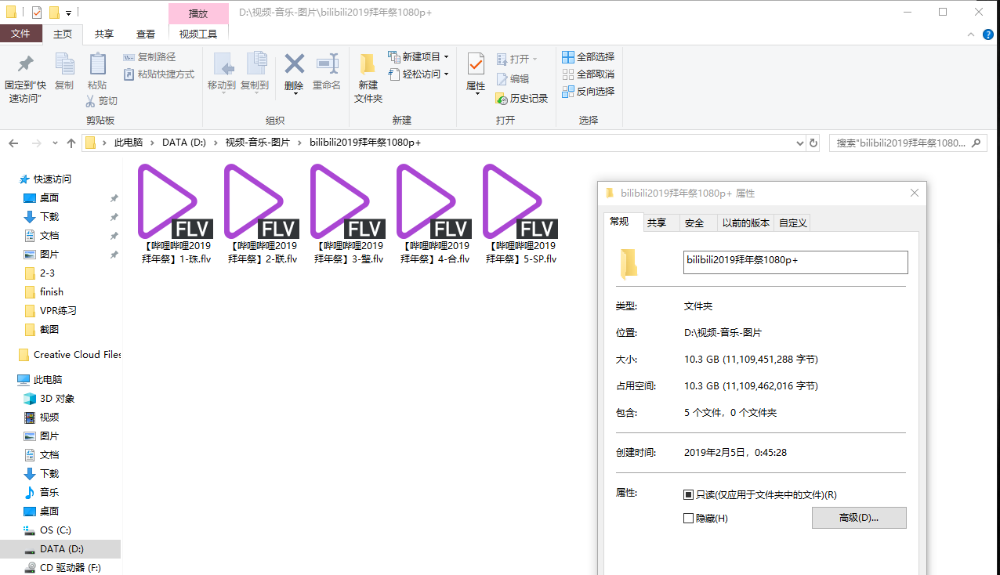

2019年2月4日，一年一度的哔哩哔哩拜年祭如约而至。不得不说，今年的拜年祭在节目质量和形式上相较于前三年都有较大的提升。出于在电视上离线播放（即非网络电视，而是读取存储设备上的媒体文件）的需求，及家中的缓慢网速达不到 Bilibili 大会员 1080P+ 无卡顿播放的程度，我利用少量的空余时间对 Bilibili 高清视频的下载方式进行了简单实践，并在本文中进行简单总结。

## ID

熟悉B站的用户应该都会了解到，B 站上的视频、音频、专栏文章、用户都是以唯一的 ID 进行标识的。以“【星尘原创】尘降【PV付/COP】”这个视频为例：其视频地址为：`https://www.bilibili.com/video/av4402328`，该视频所对应的音频的地址为：`https://www.bilibili.com/audio/au18065`，上传该视频的UP主的个人主页地址为：`https://space.bilibili.com/396194`。由此我们可以获取到以下类型的唯一 ID：

* 视频 ID [Anime (Video) ID, aid/avid]：`4402328`
* 音频 ID [Audio ID, auid]：`18065`
* 用户 ID [User ID, uid]：`396194`

中包含的“av”、“au”、“cv”等均是为了区分 ID 的类型所用。在 Ajax 请求过程中各 ID 的值均为数字，不包含字符。

在上述例子中没有包括的、实际应用的 ID 类型还有（不完全）<sup>[1]</sup>：

* 文章 ID [Content Viewing ID, cvid]
* 内容 ID [Content ID, cid]
* 通知 ID [Notification ID, nfid]
* 会员 ID [Member ID, mid]
* 标签 ID [Tag ID, tid]
* 顺序 ID [Order ID, oid]
* 分类 ID [Type ID, typeid]
* 直播间 ID [Room ID, roomid]
* 剧集 ID [Episode ID, epid]

在下载视频的时候，起到主要作用的是 aid 和 cid 这两个唯一 ID。aid 和 cid 的区别是：aid 既可以指单个视频，也可以指含有多个视频的播放列表，而 cid 是视频级唯一的。

<!--more-->

## 活动专题页面找 aid

Bilibili 为拜年祭活动设计了专门的活动页面。链接为：

```html
https://www.bilibili.com/blackboard/bnj2019.html
```

播放拜年祭视频的小电视播放器作为 HTML5 组件放置在活动页面内。使用开发者工具查看视频统计数据的 HTTP 请求，可以发现该播放器播放视频对应的 aid。比如默认情况下播放页面均会展示视频的总播放量、回复数、投币数等。如下图：


<center>普通播放页面的统计信息</center>


<center>拜年祭播放页面的统计信息</center>

不难发现，获取这些统计信息所请求的链接地址（以拜年祭为例）是：

```html
https://api.bilibili.com/x/web-interface/archive/stat?aid=36570401
```

返回的 JSON 数据（格式化后）如下：

```json
{
    "code": 0,
    "message": "0",
    "ttl": 1,
    "data": {
        "aid": 36570401,
        "view": 34739455,
        "danmaku": 1328696,
        "reply": 195310,
        "favorite": 1299858,
        "coin": 1859584,
        "share": 300501,
        "like": 1465982,
        "now_rank": 0,
        "his_rank": 0,
        "no_reprint": 0,
        "copyright": 1
    }
}
```

上面链接和 JSON 数据中“aid”均为视频对应的视频 ID。注：该链接实际上也是获取视频统计数据的 API 接口。在此处不对此链接进行进一步说明。

由此我们得到了拜年祭视频的正常播放地址应为：

```html
http://www.bilibili.com/video/av36570401/
```

## 下载1080P及以下清晰度视频的办法

最为简便的方法是，我们可以利用已有的视频下载网站进行下载。这里我们举两个例子。

### 唧唧下载站，分段法

[唧唧视频下载站](https://www.jijidown.com/)也是一种下载视频的办法。它通过视频的热度高低来判断视频是否应预先解析和缓存在云端。较热门的视频可以直接从唧唧网站的服务器获取。较冷门的视频则可以通过客户端下载。客户端会尝试直接解析视频直连、修改 Referer 等进行分段下载然后合并。同时，该网站同时也拥有 MP3 转换服务，将视频中的音轨提取、转码后供用户下载。

### ParseVideo，直链法

[ParseVideo](https://www.parsevideo.com/) 则不提供客户端和云端缓存。这个网站的作用是直接解析出对应视频、对应清晰度的完整视频的直链，获得的直链可以用下载工具直接下载。例如：2019 拜年祭中，第一部分“珠”的 1080P 清晰度完整视频直链如下：

```html
http://upos-hz-mirrorwcsu.acgvideo.com/upgcxcode/94/37/74633794/74633794-1-208.mp4?ua=tvproj&deadline=1550125016&gen=playurl&nbs=1&oi=2501663261&os=wcsu&trid=c01282c601bb4b0cb444a9b53342fc2e&uipk=5&upsig=556e65a3992c1531227fb43bcb6705a3
```

## 视频地址从哪来？

视频地址（参数的作用其实绝大部分都是鉴权和防盗链）可以从 Bilibili 的视频播放页获得。在加载视频前，HTML5 播放器会首先加载一个包含当前清晰度的视频链接的文件，名为 `playurl`。获取播放地址的完整链接为（登录状态下的 1080P+ 链接，Session MD5 部分隐去）：

```html
https://api.bilibili.com/x/player/playurl?avid=36570401&cid=74633794&qn=112&type=&otype=json&fnver=0&fnval=16&session=4710f|sec|
```

得到的 JSON 数据（格式化并去除转义字符后）类似这样（部分参数含有隐私信息，因此隐去，隐去部分用 `|sec|` 标识）：

```json
{
    "code": 0,
    "message": "0",
    "ttl": 1,
    "data": {
        "from": "local",
        "result": "suee",
        "message": "",
        "quality": 112,
        "format": "hdflv2",
        "timelength": 2961402,
        "accept_format": "hdflv2,flv,flv720,flv480,flv360",
        "accept_description": ["高清 1080P+", "高清 1080P", "高清 720P", "清晰 480P", "流畅 360P"],
        "accept_quality": [112, 80, 64, 32, 16],
        "video_codecid": 7,
        "seek_param": "start",
        "seek_type": "offset",
        "dash": {
            "duration": 2961,
            "minBufferTime": 1.5,
            "video": [{
                "id": 112,
                "baseUrl": "http://upos-hz-mirrorks3u.acgvideo.com/upgcxcode/94/37/74633794/74633794-1-30112.m4s?e=ig8eux|sec|&deadline=1550136700&gen=playurl&nbs=1&oi=1885698042&os=ks3u&platform=pc&trid=126ef7|sec|&uipk=5&upsig=c71526|sec|",
                "backupUrl": null,
                "bandwidth": 5826637,
                "mimeType": "video/mp4",
                "codecs": "avc1.640028",
                "width": 1920,
                "height": 1080,
                "frameRate": "16000/672",
                "sar": "1:1",
                "startWithSap": 1,
                "SegmentBase": {
                    "Initialization": "0-992",
                    "indexRange": "993-8128"
                },
                "codecid": 7
            }],
            "audio": [{
                "id": 30280,
                "baseUrl": "http://upos-hz-mirrorks3u.acgvideo.com/upgcxcode/94/37/74633794/74633794_nb1-1-30280.m4s?e=ig8eux|sec|&deadline=1550136700&gen=playurl&nbs=1&oi=1885698042&os=ks3u&platform=pc&trid=126ef7|sec|&uipk=5&upsig=5f58ae|sec|",
                "backupUrl": null,
                "bandwidth": 321706,
                "mimeType": "audio/mp4",
                "codecs": "mp4a.40.2",
                "width": 0,
                "height": 0,
                "frameRate": "",
                "sar": "",
                "startWithSap": 0,
                "SegmentBase": {
                    "Initialization": "0-907",
                    "indexRange": "908-8055"
                },
                "codecid": 0
            }, {
                "id": 30216,
                "baseUrl": "http://upos-hz-mirrorcos.acgvideo.com/upgcxcode/94/37/74633794/74633794-1-30216.m4s?um_deadline=1550136700&platform=pc&rate=0&oi=1885698042&um_sign=df1a58|sec|&gen=playurl&os=cos&trid=126ef7|sec|",
                "backupUrl": null,
                "bandwidth": 67238,
                "mimeType": "audio/mp4",
                "codecs": "mp4a.40.2",
                "width": 0,
                "height": 0,
                "frameRate": "",
                "sar": "",
                "startWithSap": 0,
                "SegmentBase": {
                    "Initialization": "0-907",
                    "indexRange": "908-8055"
                },
                "codecid": 0
            }]
        }
    }
}
```

playurl 获取时各个参数的含义：

* avid，即视频 ID。cid，即该视频所对应的内容 ID。
* qn，视频质量代码。对应的是 JSON 格式中“accept\_quality”这个 list 中的值。
* otype：数据的呈现形式。可以是 JSON 或 XML。
* type：用途不明。可能跟平台类型有关。
* fnver：用途不明。
* fnval：控制视频的格式。fnval 为 0 时是 FLV 格式，为 1 时是 MP4 格式，为 16时是 DASH 序列。

因此获取视频ID为 36570401（对应的内容ID为 74633794）的 1080P FLV 格式的播放地址（注意：不是直链，也不能直接播放，仅为小电视播放器能够解析的地址）并展示为 XML 格式的链接：

```html
https://api.bilibili.com/x/player/playurl?avid=36570401&cid=74633794&qn=80&otype=xml&fnval=0
```

以上结束了针对 playurl 的讨论。至于如何构造参数使得 playurl 包含的视频链接可供下载和播放，因为没有更深层的探究，所以此处不继续讨论。但是视频直链中包含“ua=tvproj”字样，又结合 Bilibili 具有 DLNA 投屏功能，可进行初步猜想：“直链”的参数构造应仿照了 App DLNA 投屏时，App 发送给 DLNA 终端的视频链接所附带的参数。

## 利用 Android App 下载高清视频

Bilibili App 内部本身拥有缓存功能，虽然并非对所有视频开放（比如：受到版权保护只能够在线观看的番剧），但是已开放缓存的视频可以利用“缓存”本身实现下载。

Bilibili 安卓客户端默认的视频缓存位置为：

```html
/storage/emulated/0/Android/data/tv.danmaku.bili/download
```

该文件夹下包含着 App 缓存的所有视频文件。视频文件的存放位置为 [该视频的视频ID]/[该视频的分P数]/lua.[视频格式].bili2api.[视频质量]/0.blv。例如，2019 拜年祭“珠”部分 1080P+ 缓存完成后的视频文件完整路径为：

```html
/storage/emulated/0/Android/data/tv.danmaku.bili/download/36570401/1/lua.hdflv2.bili2api.112/0.blv
```

已缓存完成视频的扩展名为 blv（Bilibili Video），未缓存完成的视频的扩展名为 bdl（Bilibili Download）。将已经缓存完毕的 blv 文件复制到其他位置，并改扩展名为 flv（根据“视频格式”进行判断）即可正常播放。



<center>成功提取后的视频文件</center>

## 获取弹幕数据

网页前端获取弹幕数据的链接为：

```html
https://api.bilibili.com/x/v1/dm/list.so?oid=74633794
```

此处 oid 的值即为对应视频 cid 的值。当然你也可以从 App 的缓存中提取弹幕数据。接上例，视频缓存对应的弹幕数据缓存文件完整路径为：

```html
/storage/emulated/0/Android/data/tv.danmaku.bili/download/36570401/1/danmaku.xml
```

另外，缓存文件夹内包含的其他文件作用列举如下：

* `entry.json` 保存缓存视频的基本信息和统计数据。
* `index.json` 保存缓存视频的下载地址。
* `0.blv.4m.sum` 保存缓存视频的字节大小。

由于互联网上已有多篇对xml弹幕数据进行综合处理的文章，所以在此处不再进一步讨论弹幕数据的处理相关内容。

## 加密直播间的密码校验 API

这里直接给出 Bilibili用于校验直播间密码的接口：

```html
https://api.live.bilibili.com/room/v1/Room/verify_room_pwd?room_id=roomid&pwd=pwd
```

其中，`room_id` 参数为直播间的房间 ID，`pwd` 参数为直播间的密码。

## 参考链接

[1] fython.&emsp;[BilibiliAPIDocs [DB/OL]](https://github.com/fython/BilibiliAPIDocs)&emsp;*获取于2019.2.14*
