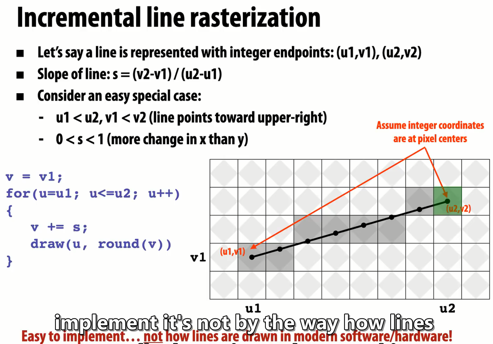

This series of notes is a **non-beginner-oriented compilation** that combines personal understanding, drawing from multiple knowledge sources including *CMU 15-462*, *Games 101: Introduction to Modern Computer Graphics*, *Games 102: Geometric Modeling and Processing*, and *Introduction to 3D Game Programming with DirectX 12*.

## What is Computer Graphics

Computer Graphics: The discipline of using computers to synthesize visual information or to synthesize/manipulate sensory information.

## Applications of Computer Graphics

- Film and Television
- Animation
- Gaming
- Data Visualization
- Industrial Design, Graphic Design
- Digital Painting
- Virtual Reality
- Virtual Reality (VR): Refers to everything seen being virtual, such as VR games, VR videos, etc.
- Augmented Reality (AR): Refers to seeing the real world combined with virtual elements that analyze, process, or modify the current reality, such as Apple ARkit.
- Mixed Reality (MR): VR + AR, using methods similar to VR to achieve the effect of AR, which combines the current reality with virtual elements, such as Hololens.
- Manufacturing (3D Printing)
- Simulation and Digital Twin
- Typesetting and Font Design
  - "The Quick Brown Fox Jumps Over The Lazy Dog": A meaningful English sentence containing all 26 letters of the alphabet, often used to test fonts (glyphs, font sizes, spacing, etc.).
  - "Lorem ipsum dolor sit amet, consectetur adipisicing elit.": Also known as "random dummy text" or "placeholder text." Its primary purpose is to test how articles or text appear in different fonts and layouts. For more information, please visit: [https://cn.lipsum.com/](https://cn.lipsum.com/).
  
<!--more-->

## The Difference Between Computer Graphics and Computer Vision

- Computer Graphics: Converting data into graphics. In other words, "drawing it out."
- Computer Vision: Converting graphics into data. In other words, "seeing it."

## What Fundamentals Are Needed for Computer Graphics

- Representation Methods (Encoding)
- Sampling and Aliasing
- Mathematical Methods (Representing 3D Objects and Motion)
- Light
- Perspective

## Thought: Displaying a Cube

- How to represent
  - Vertices: Using coordinates
  - Edges: Uniquely determined by their two vertices
- How to Draw
  - Converting 3D Graphics to 2D Graphics: Pinhole Camera Model
    - Let the camera coordinates be $(a,b,c)$, and the coordinates of the point to be determined be $(x,y,z)$. To obtain the coordinates of this point on a 2D plane, follow these algorithmic steps:
    - 1. Subtract $(x,y,z)$ from $(a,b,c)$ to obtain the relative position of the original 3D point to the camera;
    - 2. Divide $(x,y)$ by $z$ to obtain $(\frac{x}{z},\frac{y}{z})$, which is the desired $(u,v)$.
  - Connecting lines. This requires a detailed explanation of how computers draw straight lines.

## Key Question: How do computers display straight lines?

- First, we need to understand how computers display images: "raster displays."
- Characteristics:
  - Images are represented as a two-dimensional grid composed of **pixels**.
  - Each pixel can have a different color value.

### Rasterization

- The process of converting continuous objects into discrete pixel representations on a raster grid (i.e., images composed of grids). It is also the process of transforming vertex data into fragments.

### How to Rasterize? (A Simple Discussion on Lines Without Thickness)

- Direct idea: As long as the original continuous object touches a pixel, that pixel should be displayed. Drawback: Large error.
- Implementation in some graphics APIs: Diamond test area method.
  - More information: <https://docs.microsoft.com/zh-cn/windows/uwp/graphics-concepts/rasterization-rules>
- Not necessarily the optimal solution: It depends on the requirements. Different algorithms are selected based on the needs.
- In addition to errors (jaggies), coverage is also one of the important metrics for evaluating rasterization effects.

### How to Find the Corresponding Grid (Pixel)?

- Brute-force method: Iterate through each pixel, check if it meets the display requirements, and light it up if it does. Drawback: Extremely slow.
- "Incremental line rasterization": A simple **demo-purpose** custom algorithm that uses the slope of the line to determine which pixels to display.
  - Given a line with a start point $(u_1,v_1)$ and an end point $(u_2,v_2)$. Assume $u_1 < u_2, v_1 < v_2$ and $0<s<1$. The pixels can be found using the following process (pseudocode):

```c
p = (u, v);
v = v1;
for(u = u1; u <= u2; u++) {
    v += s;
    draw(u, round(v));
}
```



### Summary

The above outlines a simple yet complete CG pipeline—from representation, to computation, to rasterization, and finally to display. However, real-world CG environments are far more complex than this. We haven't mentioned some crucial knowledge and algorithms that are vital for the realism of images (rendering), such as:

- Geometry, especially complex geometry
- Materials, whether transparent, translucent, or opaque
- Light, lighting
- Camera
- Motion

## Four Major Application Areas

- Common Graphics APIs: OpenGL, (Vulkan), DirectX 11, (DirectX 12)
- 1. Rasterization
  - Project geometric primitives onto the screen and split the projected geometric primitives into "pixels"
  - Rasterization in Modern OpenGL: <https://vispy.org/getting_started/modern-gl.html>
  - [Perspective Projection](https://max.book118.com/html/2016/1123/64908259.shtm) and [Orthographic Projection](https://en.wikipedia.org/wiki/Orthographic_projection).
- 2. Ray Tracing
  - Cast rays (sampling view directions) from the camera to each pixel.
  - Calculate intersection and shading.
  - Continue bouncing the ray until it returns to the light source.
  - Reference: <https://en.wikipedia.org/wiki/Ray_tracing_(graphics)>.
- Curves and Mesh
  - Methods for representing geometric objects in computer graphics.
  - [Bézier curve](https://en.wikipedia.org/wiki/B%C3%A9zier_curve)
  - [Catmull-Clark subdivision surface](https://en.wikipedia.org/wiki/Catmull%E2%80%93Clark_subdivision_surface), reference <https://blog.csdn.net/McQueen_LT/article/details/106102609>
- Animation and simulation
  - Keyframe (K-frame) animation
  - Mass Spring system model, see: <https://blog.csdn.net/u011618339/article/details/106225426>
