## Snort 简介

[Snort](https://www.snort.org/)，是一款开源的 IDS/IPS 软件，由思科公司（Cisco）主导开发，使用广泛。Snort 有三种模式——包嗅探模式（Packet Sniffer）、包记录模式（Packet Logging）、IPS模式（Intrusion Prevention System）。搭配自定义的规则、不同的插件与其他软件，Snort 能在不同的系统中发挥不同的作用。

本篇文章简单记录 Snort3 的编译、安装和简单使用流程。

## 编译安装 Snort3

例子中使用的操作系统是 Ubuntu Server 20.04.3 LTS。当然你也可以使用 Ubuntu 18.04.5 LTS，或者其他 Linux 发行版。某些发行版由于内核配置原因无法编译 libdaq 的部分插件（例如 NFQ），这时 Snort 虽然无法提供防护功能，但仍然可以作为入侵检测系统（IDS）来使用。

### 快速导入 Ubuntu Server 虚拟机

Ubuntu Server 虚拟机其实不必下载 ISO 镜像后再用 VMWare 等虚拟化软件从头进行安装。Ubuntu 官方已经提供了预安装的虚拟磁盘的下载（如 [Kali Linux 官方](https://www.offensive-security.com/kali-linux-vm-vmware-virtualbox-image-download/)所做的那样），即 [Ubuntu Cloud Images](https://cloud-images.ubuntu.com/)。

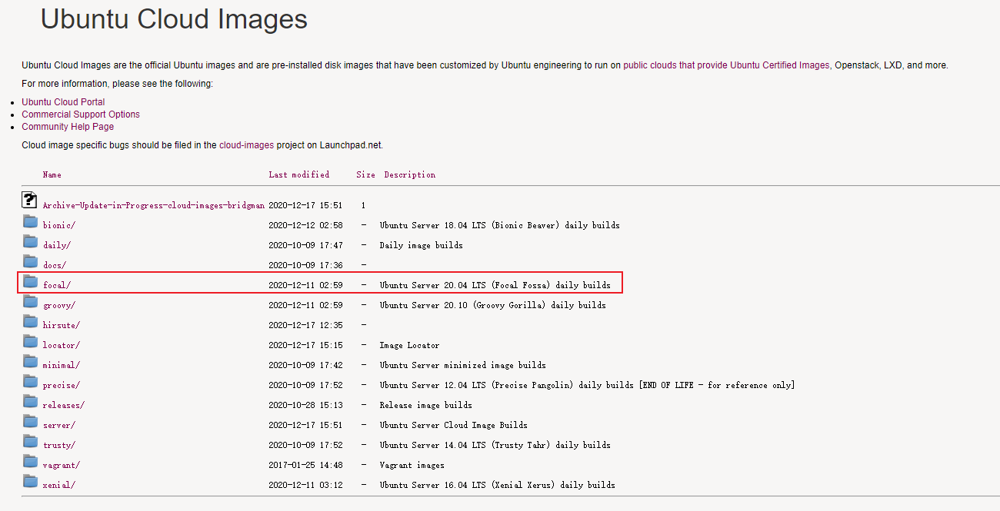

<!--more-->

以 20.04 LTS daily build 为例，找到对应的 OVA 文件：

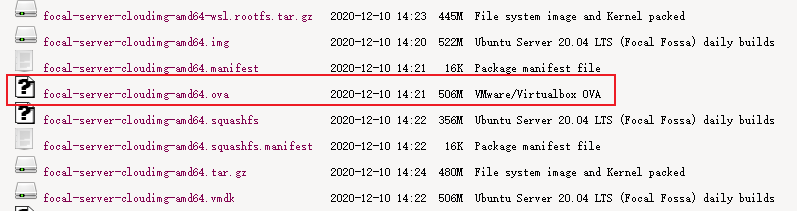

以VMWare Workstation为例，双击下载的OVA文件，唤起VMWare Workstation的导入向导；或先打开VMWare Workstation主程序，左上角“文件”菜单中点击“打开”，然后选择OVA文件。

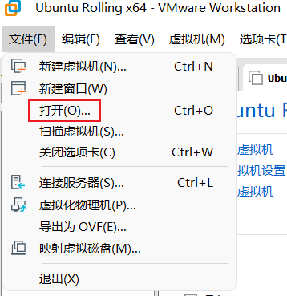

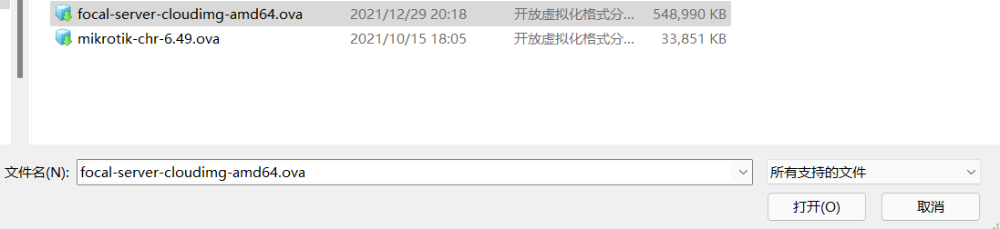

随后进行OVA导入时的初始化设置。

首先填入虚拟机名称和存储位置。

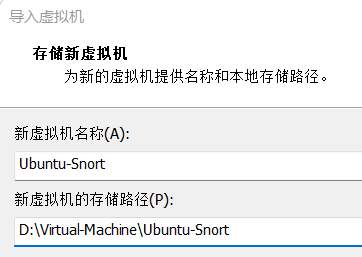

随后设置系统详情。

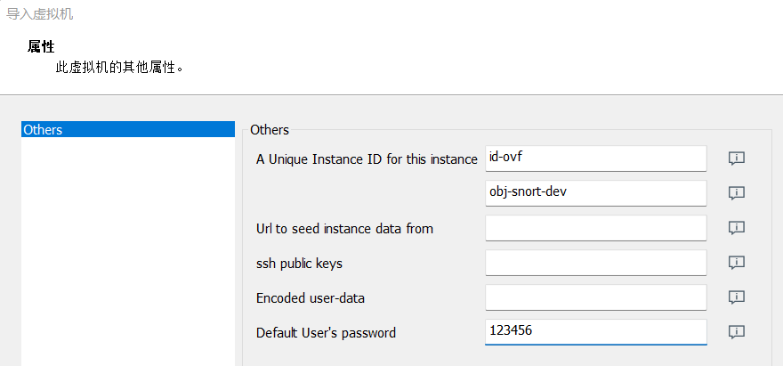

由上至下依次解释不同字段的含义：

- “该实例的唯一ID”：云服务管理器中可见的ID（第一个输入框，默认值为`id-ovf`，在VMWare Workstation中导入时保持默认值）和主机名。
- “获取种子数据的URL”：从特定位置获取用户设置数据进行无应答安装，脱离管理器使用时可以忽略。
- “SSH公钥”：如果需要通过公钥登录SSH，则将公钥复制粘贴进该输入框。
- “编码的用户数据”：Base64编码的用户设置数据，用于无应答安装，不使用的情况下留空。
- “默认用户的密码”：是系统中默认的普通权限用户**ubuntu**的首次登陆密码，即系统的首次登陆密码。可以设置为一个临时密码，登陆后强制要求修改。

关于user-data和meta-data的更多信息，可参阅[cloud-init文档](https://cloudinit.readthedocs.io/en/latest/index.html)。

### 虚拟机导入后的设置

#### 修改虚拟机设置

在虚拟机设置中，按需修改CPU、内存的分配值，同时可以移除（我猜应该没人需要）软盘驱动器选项。扩展磁盘容量（例如我在这里扩展到了30.0GB）。同时将网络适配器的设置进行修改，例如改为NAT模式。

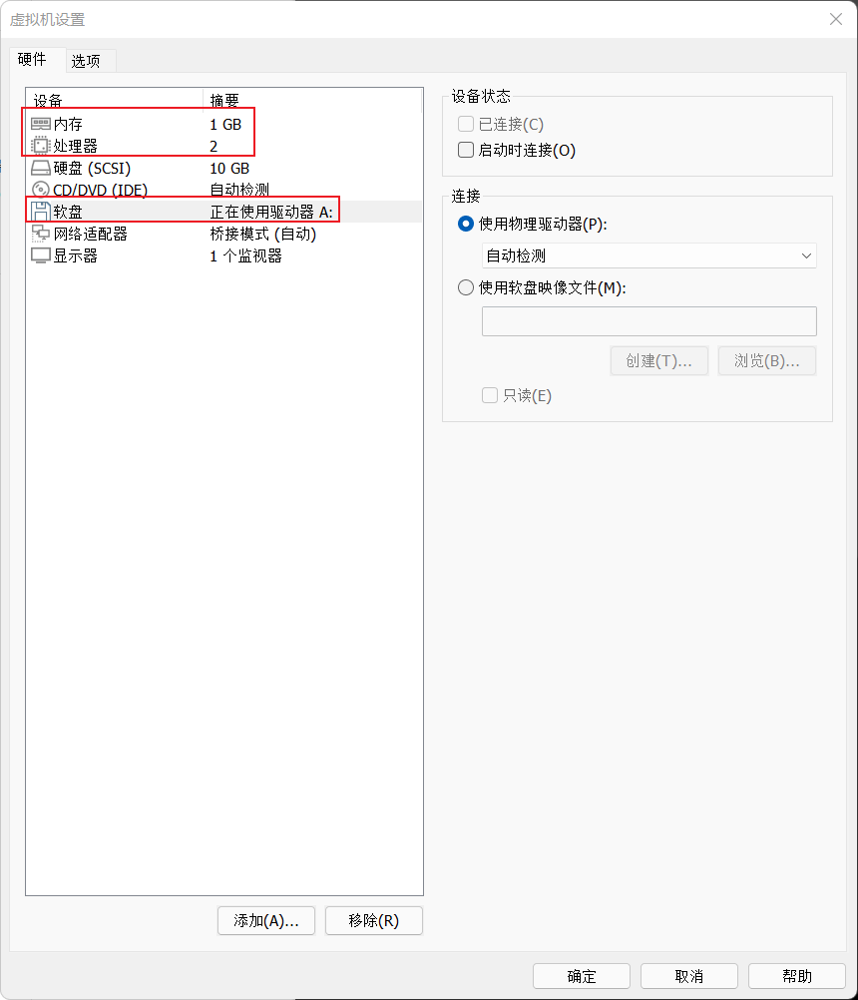

> 注意：按下面文档的操作，编译时虚拟机至少需要2GB运行内存。

#### 如何登陆

开机，待登陆界面出现后，使用**ubuntu作为登陆用户名、在向导中设置的用户密码作为登陆密码**登陆系统。

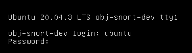

随向导更改密码：

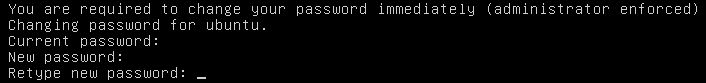

即可成功登陆。

#### 禁用云服务组件

关闭并禁止cloud-config服务启动。

```bash
sudo service cloud-config stop
sudo systemctl disable cloud-config.service
sudo service cloud-init stop
sudo systemctl disable cloud-init.service
```

可以卸载相关软件包：

```bash
sudo apt-get remove -y cloud-init
```

同时rsync、snapd等程序也可以按照需要进行卸载。

#### DNS解析

修改DNS解析可以结合以下命令：

```bash
ip addr #获取网卡接口名称
sudo resolvectl dns <网卡名称> <DNS服务器IP> 
```

#### 修改APT源

编辑`/etc/apt/sources.list`，更换apt源至国内源。教程很多，此处不做详细说明。

#### 修改控制台的分辨率

处于控制台模式下时，发现默认分辨率为700x400px。这时除了设置OpenSSH Server通过远程连接虚拟机外，还可以通过修改Grub配置来改变控制台分辨率。

以修改为1600x1200px为例，在`/etc/default/grub`中加入以下两行：

```
GRUB_GFXMODE=1600x1200
GRUB_GTXPAYLOAD_LINUX=1600x1200
```

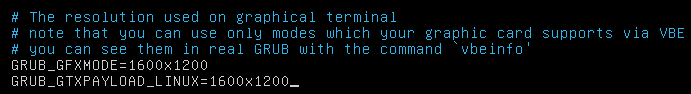

保存后运行：

```bash
sudo update-grub
```

重启即可看到效果。[^1]

#### 使SSH服务允许使用密码登陆

默认已安装和启用SSH服务。若需要ubuntu用户通过密码连接至虚拟机，编辑`/etc/ssh/sshd_config`，查找如下行：

```
PasswordAuthentication no
```

改为`yes`，并重新启动SSH服务即可。

#### 分区扩容

使用`parted`进行分区扩容。

```bash
sudo parted /dev/sda
p
resizepart 1
yes
-1
p
q
```

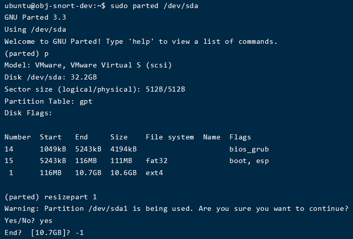

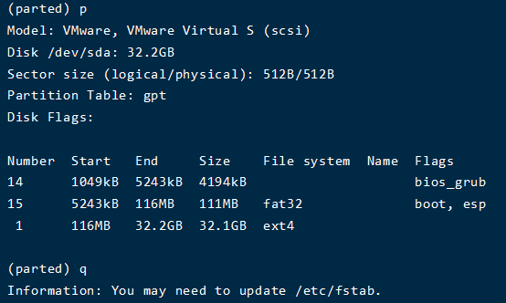

随后使用`resize2fs`进行文件系统扩容。

```bash
sudo resize2fs /dev/sda1
```

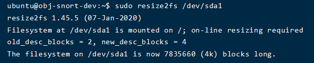

至此已成功扩容。

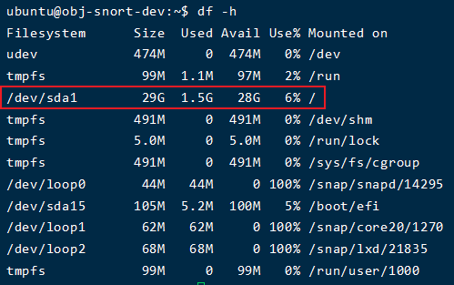

#### 安装基本开发环境

```bash
sudo apt-get install -y build-essential cmake autoconf
```

其他安装过程中需要的依赖，在详细步骤中进行说明。

### 安装新版 libpcap

安装依赖：

```bash
sudo apt-get install -y flex bison
```

下载源代码，可以选择下载tar包解压：

```bash
# 可能已有更新版本，可以去官网查看最新版本下载地址
# https://www.tcpdump.org/
wget https://www.tcpdump.org/release/libpcap-1.10.1.tar.gz
tar -xzf libpcap-1.9.1.tar.gz
```
或者官方Github Mirror：

```bash
# 可能已有更新版本，可以去Github查看最新版本Tag
git clone https://github.com/the-tcpdump-group/libpcap.git --branch libpcap-1.10.1 --depth 1 libpcap-1.10.1
```

随后进行配置和安装，以`/usr/lib`作为安装目录：

```bash
cd libpcap-1.10.1/
./configure --prefix=/usr
make -j2
sudo make install
```

> FAQ：我直接安装官方源中的`libpcap-dev`不行吗？

可以尝试，但可能遇到libpcap版本过低、Snort3无法使用的情况。因此还是建议官网编译安装最新版本的libpcap。

### 安装 netmap（可选步骤）

下载源代码：

```bash
# 可能已有更新版本，可以去Github查看最新版本Tag
git clone https://github.com/luigirizzo/netmap.git --branch v13.0 --depth 1
```

编译安装[^2]：

```bash
cd netmap/
./configure --prefix=/usr
make -j2
sudo make install
```

### 安装 libdaq

安装依赖：

```bash
sudo apt-get install -y pkg-config libtool libmnl-dev nftables
```

下载源代码：

```bash
# 可能已有更新版本，可以去Github查看最新版本Tag
git clone https://github.com/snort3/libdaq.git --branch v3.0.5 --depth 1
```

编译安装：

```bash
cd libdaq/
./bootstrap
./configure --prefix=/usr
make -j2
sudo make install
```

注意：

- 若需要在“检测”的同时启用“过滤”功能，必须保证NFQ DAQ module处于开启状态。
- Divert module是BSD独有的模块。
- netmap module需要手动安装，且是可选项。

### 安装 libdnet

下载源代码：

```bash
# 长时间没有发布新的版本，直接使用主分支
git clone --depth 1 https://github.com/ofalk/libdnet.git
```

编译安装：

```bash
cd libdnet/
./configure --prefix=/usr
make -j2
sudo make install
```

> FAQ：我直接安装官方源中的`libdnet-dev`不行吗？

是**不行**的。`libdnet-dev`包不是Snort3需要的libdnet库，而是Debian系列系统下的DECnet库。Snort3需要的libdnet库在Ubuntu的官方源中是`libdumbnet-dev`包。

> FAQ：那我安装`libdumbnet-dev`包不行吗？

理论上可以，但**非常麻烦**，因为需要修改Snort3的编译命令，将`-ldnet`全部修改为`-ldumbnet`。

### 安装Snort

安装依赖：

```bash
sudo apt-get install -y libhwloc-dev luajit libluajit-5.1-dev libssl-dev libpcre3-dev zlib1g-dev liblzma-dev libunwind-dev uuid-dev libhyperscan-dev libflatbuffers-dev libsafec-dev libjemalloc-dev
```

下载源代码：

```bash
# 可能已有更新版本，可以去Github查看最新版本Tag
git clone https://github.com/snort3/snort3.git --branch 3.1.19.0 --depth 1
# 创建安装目录
sudo mkdir /opt/snort
./configure_cmake.sh --prefix=/opt/snort --enable-jemalloc
cd build/
make -j2
sudo make install
```

随后可以运行：

```bash
/opt/snort/bin/snort -V
```

查看Snort3的版本。

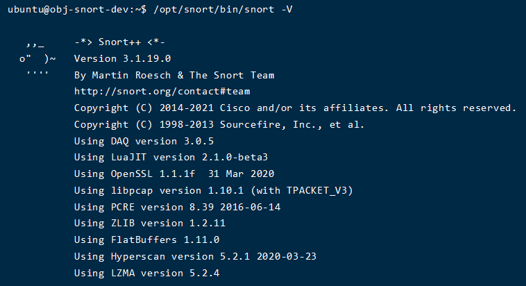

这就结束了整个编译和安装过程。

## 简单使用Snort

使用简单的明文Telnet测试Snort3是否可以正常使用。

### 虚拟网络环境设置

共有三台虚拟机同时运行：

- Telnet服务器，只有一块NAT网卡（VMNet8），IP地址：192.168.232.130
- Telnet客户端，只有一块Host-Only网卡（VMNet2），IP地址：192.168.153.128
- Snort3机器，有NAT网卡（VMNet8）和Host-Only网卡（VMNet2）。IP地址分别为：192.168.232.134，192.168.153.129

对Snort3机器的网络进行设置：

首先，使用

```bash
ip addr
```

查看第二块网卡的设备名和MAC地址。

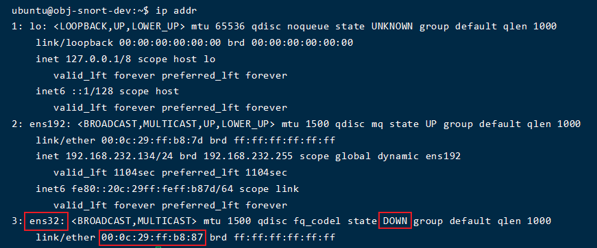

编辑netplan配置文件：

```bash
sudo nano /etc/netplan/50-cloud-init.yaml
```

仿照第一个网卡的设置，设置第二个网卡的静态IP[^4]。

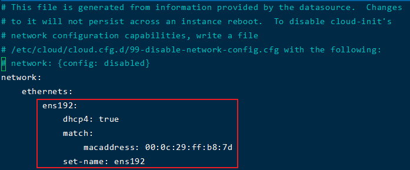

```yaml
ens32:
    addresses:
        - 192.168.153.129/24
    match:
        macaddress: 00:0c:29:ff:b8:87
    set-name: ens32
```

随后重启，或者直接应用netplan设置：

```bash
sudo netplan apply
```

再开启网卡：

```bash
sudo ip link set ens32 up
```

即可看到两个网卡的IP地址。

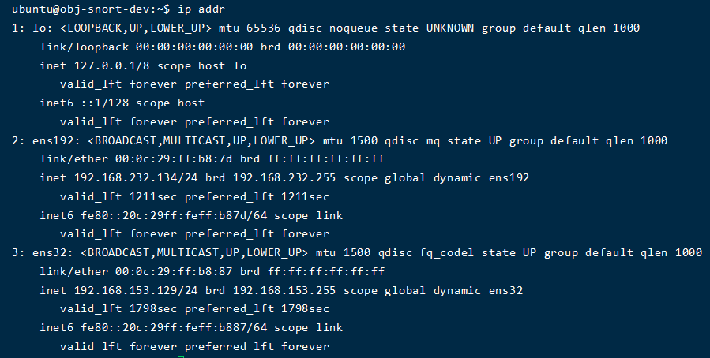

### Telnet服务器设置

系统版本：Ubuntu 20.04.3 LTS Desktop amd64

安装Telnet服务器：

```bash
sudo apt-get install -y xinetd telnetd
```

创建Telnet Server配置文件：

```bash
sudo nano /etc/xinetd.d/telnet
```

配置文件中按需修改和保存以下内容[^3]：

```properties
# default: on
# description: The telnet server serves telnet sessions; it uses
# unencrypted username/password pairs for authentication.
service telnet
{
        disable = no
        flags = REUSE
        socket_type = stream
        wait = no
        user = root
        server = /usr/sbin/in.telnetd
        log_on_failure += USERID
}
```

重启xinetd服务：

```bash
sudo service xinetd restart
```

即可接受客户端的Telnet连接。

### Telnet客户端设置

系统版本：Windows 10 LTSC 2021 amd64，Build 19044.1415

安装Telnet客户端：

控制面板 -> 程序 -> 程序和功能 -> 启用和关闭Windows功能，勾选“Telnet客户端” -> 确定。

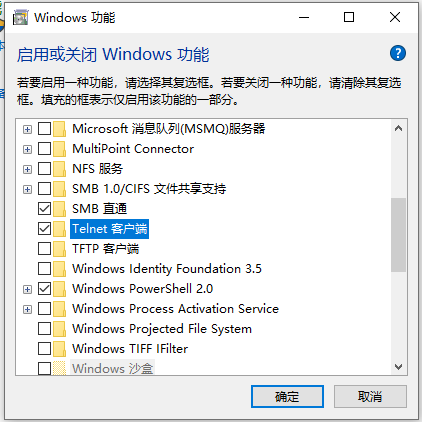

随后打开Windows PowerShell，用以下命令即可启动Telnet连接：

```bash
telnet <IP地址> <端口号>
```

### 设置网关

Windows上打开网络与共享中心，修改以太网的网关为192.168.153.129，并填写公网DNS服务器：

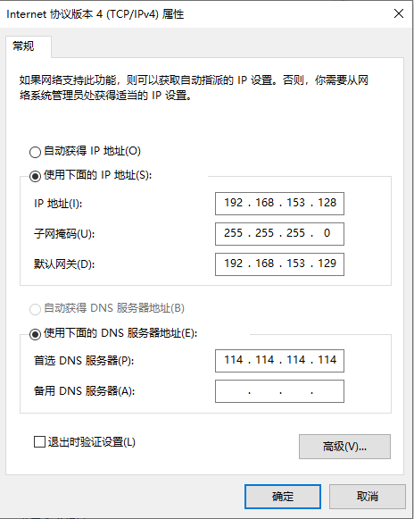

此时Windows可访问Snort3机器，不可访问Telnet Server机器。

在Snort3机器上打开IPv4包转发功能：

```bash
sudo su
echo 1 > /proc/sys/net/ipv4/ip_forward
```

同时修改`/etc/sysctl.conf`，使IPv4包转发持续开启。

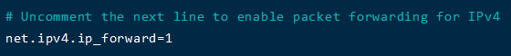

修改iptables规则，设置转发和混杂模式：

```bash
sudo iptables -A FORWARD -i ens32 -o ens192 -j ACCEPT
sudo iptables -t nat -A POSTROUTING -o ens192 -j MASQUERADE
# 保存配置
sudo iptables-save > iptables.conf
```

此时，Telnet客户端机器已可以连接Telnet服务器。

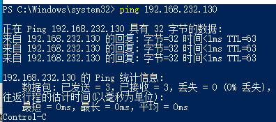

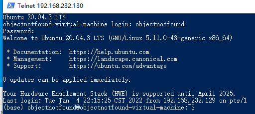

### Snort的记录模式

示例命令：

```bash
sudo /opt/snort/bin/snort -i ens32 -L dump -d
```

包输出举例：

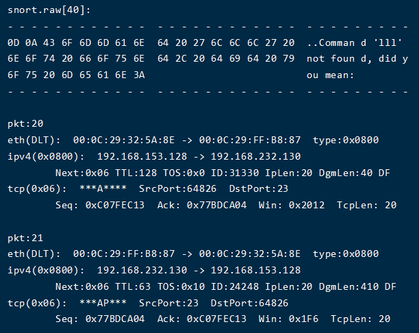

包统计举例：

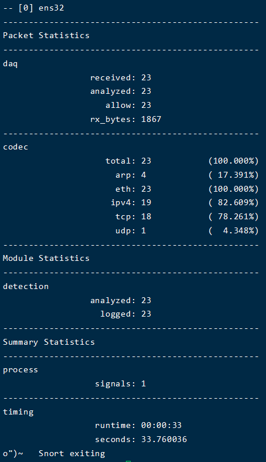

也可以作为抓包工具使用。示例命令：

```bash
sudo mkdir /opt/snort/pcap # 用于存放生成的pcap文件的文件夹
sudo /opt/snort/bin/snort -i ens32 -L pcap -l /opt/snort/pcap -d -e
```

### 简单上手Snort的检测模式

检测/过滤模式需要结合Snort的“配置文件”和“规则文件”进行使用。

```bash
mkdir snort_rules # 存放配置文件和规则文件
cd snort_rules/
touch config.lua # Snort的配置文件
touch telnet.rule # 针对Telnet的报警规则
```

参照`/opt/snort/etc`内的内容，编写`config.lua`：

```lua
-- 导入通用流式协议解析规则、IP协议解析规则和TCP流解析规则
-- 可通过 --help-module $mod 查看详情
stream = {}
stream_ip = {}
stream_tcp = {}

-- 设置检测规则
ips = 
{
	-- 包含外部文件内的规则
	include = 'telnet.rule',

	-- 传递变量
	variables =
	{
		nets = 
		{
			-- “外部网络”IP
			EXTERNAL_NET = 'any',
			-- "需要被保护的“IP
			HOME_NET = '192.168.232.130'
		}
	}
}
```

以及编写规则[^5]。以“检测用户通过Telnet输入了sudo”为例：

```properties
# 声明协议类型、IP地址、数据流向等
alert tcp $EXTERNAL_NET any -> $HOME_NET 23 (
     # 自定义提示消息
	msg: "\"sudo\" appeared in telnet.";
	flow: to_server, established;
	# 不区分大小写
	content: "sudo", nocase;
)
```

启动Snort3。示例命令：

```bash
sudo /opt/snort/bin/snort -c config.lua -i ens32 -A fast -d
```

进行测试，成功产生警告：

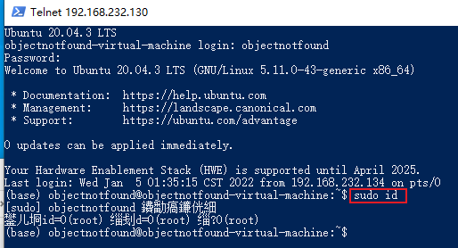

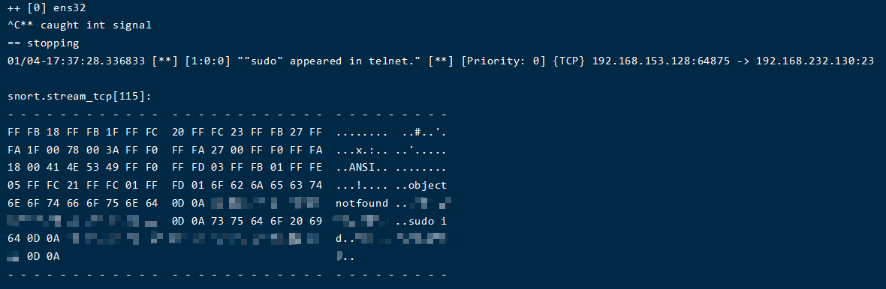


[^1]: 参阅[tty - How do I increase console-mode resolution? - Ask Ubuntu](https://askubuntu.com/questions/18444/how-do-i-increase-console-mode-resolution)，可能遇到方法失效的情况。

[^2]: 参阅[luigirizzo/netmap: Automatically exported from code.google.com/p/netmap](https://github.com/luigirizzo/netmap#linux)，可能需要完整内核源码，且只对特定型号的网卡有效。

[^3]: 参阅[17.4.2. The /etc/xinetd.d/ Directory Red Hat Enterprise Linux 4 | Red Hat Customer Portal](https://access.redhat.com/documentation/en-us/red_hat_enterprise_linux/4/html/reference_guide/s2-tcpwrappers-xinetd-config-files)。

[^4]: 参阅[Netplan | Backend-agnostic network configuration in YAML](https://netplan.io/examples/)。

[^5]: [snort3-community-rules](https://www.snort.org/downloads/community/snort3-community-rules.tar.gz)是不错的参考资料。
